# Generative Artificial Intelligence
### Course — Foundations, Architecture, Training, and the 2026 State of the Art

**Clément Gicquel** — cortAIx Factory (JV Naval Group / Thales), AI Solution Architect 

**About cortAIx Factory:** cortAIx Factory is a joint venture between Thales and Naval Group dedicated to accelerate artificial intelligence solutions development for critical systems. It focuses on delivering robust and trustworthy AI solutions.

---

## Table of Contents

1. [Course Roadmap & Learning Objectives](#1-course-roadmap--learning-objectives)
2. [Foundations: What Is Generative AI](#2-foundations-what-is-generative-ai)
3. [From Text to Numbers: NLP Foundations](#3-from-text-to-numbers-nlp-foundations)
4. [The Transformer Architecture](#4-the-transformer-architecture)
5. [Pretraining LLMs & Scaling Laws](#5-pretraining-llms--scaling-laws)
6. [Prompt Engineering & In-Context Learning](#6-prompt-engineering--in-context-learning)
7. [Decoding Strategies](#7-decoding-strategies)
8. [Fine-Tuning](#8-fine-tuning)
9. [Parameter-Efficient Fine-Tuning (PEFT)](#9-parameter-efficient-fine-tuning-peft)
10. [Aligning Models with Human Feedback](#10-aligning-models-with-human-feedback)
11. [Retrieval-Augmented Generation (RAG)](#11-retrieval-augmented-generation-rag)
12. [Evaluating LLMs](#12-evaluating-llms)
13. [Multimodal Generative Models](#13-multimodal-generative-models)
14. [Agentic AI & Tool Use](#14-agentic-ai--tool-use)
15. [Responsible AI: Risks, Limitations, Governance](#15-responsible-ai-risks-limitations-governance)
16. [The 2026 State-of-the-Art Landscape](#16-the-2026-state-of-the-art-landscape)
17. [Practical Ecosystem & Tools](#17-practical-ecosystem--tools)
18. [Group Project](#18-group-project)
19. [Glossary](#19-glossary)
20. [References](#20-references)

---

## 1. Course Roadmap & Learning Objectives

> **Key Takeaway:** A 20-hour, 8-module path from foundations to the 2026 frontier: by the end, you can explain transformer internals mathematically, reason about scaling trade-offs, choose an adaptation strategy (prompting vs. PEFT vs. fine-tuning vs. RAG) and justify it quantitatively, and explain how RLHF/DPO/RLVR shape model behavior.

**Format:** 3 days, interactive lectures and hands-on. 
- Wednesday 11/09/2026 08:00 - 12:00 & 14:00 - 18:00
- Thuesday 15/09/2026 14:00 - 18:00
- Wednesday 18/09/2026 08:00 - 12:00 & 14:00 - 18:00

### Breakdown

| Block | Hours | Content |
|---|---|---|
| **Module 1 — Foundations** | 3h | §2–3: Generative vs discriminative AI, NLP foundations, tokenization, embeddings |
| **Module 2 — Architecture** | 3h | §4: The transformer, self-attention, multi-head attention, positional encoding, modern refinements |
| **Module 3 — Training at Scale** | 3h | §5: Pretraining objective, compute, scaling laws, Mixture-of-Experts |
| **Module 4 — Using LLMs** | 3h | §6–7: Prompt engineering, in-context learning, decoding strategies (hands-on) |
| **Module 5 — Adapting LLMs** | 3h | §8–9: Fine-tuning, catastrophic forgetting, PEFT, LoRA/QLoRA (hands-on) |
| **Module 6 — Alignment** | 2h | §10: RLHF, DPO, RLVR |
| **Module 7 — Augmenting LLMs** | 2h | §11, §14: RAG, agentic AI and tool use (hands-on) |
| **Module 8 — Evaluation, Multimodality, Responsible AI** | 1h | §12–13, §15 |
| **Wrap-up & Group Project** | — | §16–18 |

### Learning objectives
By the end of this course, you should be able to:
- Explain what happens inside a Large Langage Model, not just describe it at a high level
- Reason about the trade-offs behind pretraining decisions (model size vs. data vs. compute) using scaling laws
- Choose the right adaptation strategy for a constraint (prompting vs. PEFT vs. full fine-tuning vs. RAG) and justify the choice quantitatively
- Explain how alignment techniques shape model behavior, including their objective functions
- Understand current (2026) architectural and alignment trends: from Mixture-of-Experts, to agentic systems
- Critically evaluate a generative AI system: what to measure, what benchmarks mean, and where they fall short
- Deploy your own conversational agent, chatGPT-like, using open tools

### Prerequisites
- Basic programming knowledge of Python
- Basic machine learning fundamentals (neural networks, gradient descent, loss functions, backpropagation)
- Familiarity with linear algebra (vectors, matrix multiplication, dot products) and basic probability (distributions, expectation)

### Assessment
- MCQ test (covers §2–13)
- Group Project (see §18)

---

## 2. Foundations: What Is Generative AI

> **Key Takeaway:** Generative models learn to produce new data resembling a training distribution (P(x)); discriminative models learn to predict a label from an input (P(y|x)). Generative tasks are typically harder to train and evaluate because there is no single "correct" output.

### 2.1 Defining intelligence, artificially

> **Key Takeaway:** AI is optimized pattern-matching over data, not human-style reasoning, even when its outputs look remarkably like reasoning.
Artificial Intelligence involves creating algorithms and computer programs that can perform tasks that would normally require human intelligence, recognizing speech or images, making decisions, and learning from experience. It's worth sitting with two contrasting expert framings before we dive into technical material:

> "There is no such thing as Artificial Intelligence."
> — Luc Julia, co-creator of Siri and VP of Innovation at Samsung

> "Deep learning is a form of machine learning that enables computers to learn from experience and understand the world in terms of a hierarchy of concepts."
> — Yoshua Bengio, Professor of Computer Science, University of Montreal, MILA, IVADO, CIFAR

Julia's provocation is a useful corrective against anthropomorphizing: everything covered in this course is pattern-matching over data via optimized linear algebra, not reasoning in the human sense, even though its *outputs* can look remarkably like reasoning. Bengio's framing is the constructive complement: deep learning works by composing simple functions into a hierarchy that can represent increasingly abstract concepts, from strokes to characters to words to meaning. Keep both framings in mind throughout this course.

### 2.2 Where generative AI sits in the broader field

> **Key Takeaway:** AI ⊃ Machine Learning ⊃ Deep Learning ⊃ {discriminative models, generative models}.

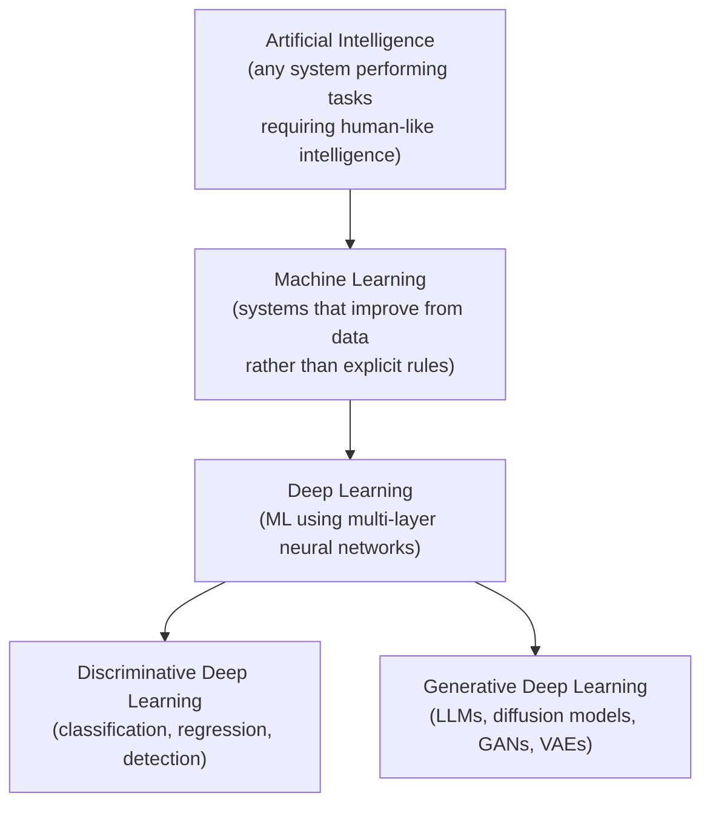

### 2.3 Discriminative vs. generative tasks

> **Key Takeaway:** - **Discriminative** = learn a decision boundary for a specific output; **Generative** = model the full data distribution to create new, plausible samples. Modern systems often combine both (e.g., a generative LLM filtered by a discriminative safety classifier).

Discriminative and generative tasks are two broad categories of tasks that AI models can be trained to perform.

| | Discriminative models | Generative models |
|---|---|---|
| Purpose | Classify or predict a specific output given an input | Generate new data similar to the training distribution |
| Learns | A decision boundary / conditional distribution P(y\|x) | The joint or marginal data distribution P(x) or P(x,y) |
| Complexity | Typically simpler, more accurate for a narrow task | More complex, harder to train and evaluate |
| Versatility | Task-specific | Broadly reusable across tasks |
| Data efficiency | Often needs less data to reach a usable accuracy | Often needs vastly more data to model a full distribution well |
| Examples | Logistic regression, SVM, most classifiers, object detectors | LLMs, diffusion models, GANs, VAEs |

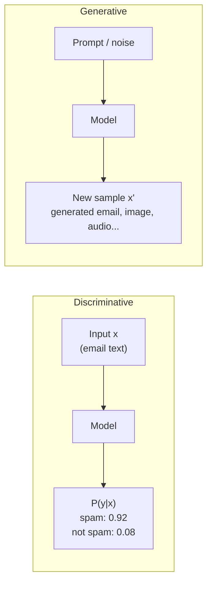

**Why this distinction matters practically:** a discriminative spam filter only ever needs to separate "spam" from "not spam", a comparatively small decision surface. A generative email-writing model must implicitly capture *everything* about what a plausible email looks like: grammar, tone, structure, plausible content, a vastly higher-dimensional target. This is why generative models are typically larger, need more data, and are harder to evaluate (there's no single "correct" output to compare against, unlike a classification label).

Both approaches address different use cases, and modern systems increasingly combine them: a generative LLM's output is frequently filtered or scored by a *discriminative* safety classifier or reward model before being shown to a user, a pattern you'll see repeatedly in this course (RLHF's reward model, RAG's re-ranker, agentic self-critique).

### 2.4 A brief history, in three waves

> **Key Takeaway:** Statistical NLP (n-grams) → RNNs (sequential, but limited long-range memory) → Transformers (parallel, long-range attention). Each wave was replaced because of a specific structural limitation.

| Wave | Era | Dominant approach | Limitation that ended it |
|---|---|---|---|
| **Statistical NLP** | 1990s–2010s | N-grams, Hidden Markov Models, Bayesian methods | Couldn't capture long-range dependencies or semantics well |
| **Recurrent Neural Networks** | ~2014–2017 | RNNs, LSTMs, GRUs, seq2seq with attention | Sequential computation (no parallelism), vanishing gradients over long sequences |
| **Transformers** | 2017–present | Self-attention, massively parallel training | Quadratic attention cost in sequence length (an active area of ongoing efficiency research) |

We will spend most of Module 2 (§4) on the transformer wave, since it underlies essentially every model you will use in this course and in practice today.

### 📝 Exercise 2.1
For each of the following, decide whether it's a discriminative or generative task, and justify in one sentence: (a) detecting whether a ship sonar signal indicates a mine or a rock, (b) writing a maintenance report summary from sensor logs, (c) predicting equipment failure probability from vibration data, (d) generating synthetic sonar training data to augment a small labeled dataset.

---

## 3. From Text to Numbers: NLP Foundations

> **Key Takeaway:** Text must become numbers before any model can process it: tokenize → assign token IDs → map IDs to learned, dense embedding vectors that capture meaning through context.

Neural networks operate on numbers, not text, so raw text must be converted into numerical representations before any model can process it. This section builds that pipeline from first principles, since every later section (attention, embeddings, fine-tuning) assumes you understand it.

### 3.1 Tokenization

> **Key Takeaway:** Subword tokenization (e.g., BPE) is the practical middle ground between word-level (huge vocabulary, fails on unseen words) and character-level (tiny vocabulary, very long sequences), it keeps sequences short while still representing any possible input.

Tokenization breaks text into units called **tokens**. Tokens can be characters, whole words, or, most commonly in modern LLMs, **subwords**: fragments that are smaller than words but larger than characters. A **tokenizer** is the algorithm responsible for this segmentation, and it is trained once on a large corpus, then frozen and reused for every subsequent training run and inference call.

**Why not just split on whitespace (word-level tokenization)?**
- Vocabulary would need one entry per distinct word form (*run, runs, running, ran* would all be separate) → huge vocabulary, poor generalization to rare words, and *any* word never seen during tokenizer training becomes an unrecoverable "unknown" token.

**Why not just use individual characters?**
- Vocabulary becomes tiny (~100 symbols) and any word is representable, but sequences become very long (a 500-word document becomes ~2500 characters instead of ~650 tokens), which is expensive since transformer compute scales roughly quadratically with sequence length (§4).

**Subword tokenization** is the practical compromise: common words stay as a single token (`"the"`), while rare or unseen words are broken into meaningful, previously-seen fragments (`"tokenization"` → `"token" + "ization"`). This keeps sequences short *and* vocabulary manageable *and* guarantees any string can be represented (worst case, fall back to individual bytes/characters).

#### Byte-Pair Encoding (BPE) — worked example
BPE, the most common subword algorithm (used by GPT-family models), works as follows:

1. Start with a vocabulary of individual characters (plus a special end-of-word marker).
2. Count all adjacent symbol pairs across the training corpus.
3. Merge the *most frequent* pair into a new single symbol; add it to the vocabulary.
4. Repeat steps 2–3 for a fixed number of merges (this merge count sets the final vocabulary size).

**Toy example.** Suppose our tiny "corpus" is the words `low, lower, lowest, newest, widest` (each appearing once), represented as characters with an end-of-word marker `_`:

```
l o w _
l o w e r _
l o w e s t _
n e w e s t _
w i d e s t _
```

- **Merge 1**: the pair `(e, s)` is the most frequent (appears in *lowest*, *newest*, *widest*) → merge into `es`.
- **Merge 2**: `(es, t)` is now most frequent → merge into `est`.
- **Merge 3**: `(l, o)` is most frequent (appears in *low, lower, lowest*) → merge into `lo`.
- **Merge 4**: `(lo, w)` → merge into `low`.
- … and so on.

After enough merges, `lowest` might tokenize as `low` + `est`, and a *novel* word like `slowest` (never seen in training) can still be represented as `s` + `low` + `est`, reusing learned subword units rather than failing outright. This is exactly why LLMs can process typos, made-up words, and code identifiers they never saw verbatim during training.

Other common subword algorithms: **WordPiece** (used by BERT, similar to BPE, but merges based on likelihood improvement rather than raw frequency) and **SentencePiece/Unigram** (treats tokenization as a probabilistic segmentation problem, and, critically, operates directly on raw text including whitespace, making it language-agnostic and avoiding the need for pre-tokenized "words," which matters for languages without spaces like Chinese or Japanese).


### 3.2 Vocabulary

> **Key Takeaway:** Vocabulary size is a deliberate trade-off: larger = shorter sequences but a costlier output layer; smaller = longer sequences but cheaper computation and often better generalization to rare words.
A **vocabulary** is the set of all tokens a model can recognize, effectively the tokenizer's output alphabet. The English language alone has roughly 170,000 distinct words; a multilingual model covering dozens of languages would need a vastly larger word-level vocabulary. This is precisely the scaling problem subword tokenization solves.

In practice, vocabulary size is a **deliberate design trade-off**, typically capped at 30k–200k tokens:
- **Larger vocabulary** → shorter sequences for the same text (each token carries more information), but a bigger, more expensive softmax output layer (§5.1) and embedding table, and less training signal per token for rare tokens.
- **Smaller vocabulary** → longer sequences (more compute per document, since transformer cost scales with sequence length), but a cheaper output layer and typically better generalization for rare words (since they're built compositionally from well-trained subword pieces).

The size is usually chosen by counting token/merge frequency across a huge corpus and keeping the top-k most frequent, where k is the target vocabulary size.

### 3.3 Converting tokens into vectors: a survey of representations

> **Key Takeaway:** Sparse, hand-crafted representations (Binary, BoW, TF-IDF) ignore meaning and word order; only dense, learned embeddings capture semantic similarity between tokens.

Once text is tokenized and each token assigned a numeric id (via a simple lookup dictionary from the vocabulary), we still need a **feature representation** — a way to turn a token id, or a whole document, into something a model's linear algebra can operate on meaningfully. Several approaches were developed before embeddings became standard; understanding them clarifies *why* embeddings are the right solution.

| Method | Principle | Vector size | Captures meaning? |
|---|---|---|---|
| **Binary Document-Term Vector** | 1 if a token is present in the document, 0 otherwise | = vocabulary size | No, ignores frequency and order |
| **Bag of Words (BoW)** | Vector entries hold the raw frequency of each token | = vocabulary size | No, ignores order and semantics ("dog bites man" = "man bites dog") |
| **N-gram vectors** | Extends BoW to bigrams, trigrams, etc. to capture local order | grows combinatorially with n | Partial, captures local order, not long-range meaning |
| **TF-IDF** | Weights term frequency by inverse document frequency, down-weighting ubiquitous words like "the" | = vocabulary size | No, still a sparse, hand-crafted statistic, not learned meaning |
| **Embeddings** | Each token id maps to a dense, *learned* n-dimensional vector | small, fixed dimension (e.g. 768–12,000) | **Yes** — learned end-to-end to capture context and meaning |

The first four methods share a critical weakness: they are **sparse** (vector size grows with vocabulary, mostly zeros) and **hand-crafted** — the numbers come from counting, not from optimizing toward a task. Embeddings flip this: rather than a fixed formula, the representation is **learned** via backpropagation to be whatever is most useful for the downstream objective.

### 3.4 Embeddings, formally

> **Key Takeaway:** An embedding layer is a learned lookup table (V×d) trained end-to-end so that tokens used in similar contexts end up with similar vectors. Unlike classic word2vec, transformer embeddings are contextual, the same token gets a different vector depending on its sentence.

An embedding layer is a lookup table:

```
E ∈ ℝ^(V × d)      where V = vocabulary size, d = embedding dimension
embedding(token_id) = E[token_id]      (a single row of E)
```

`E` starts randomly initialized and is updated by gradient descent along with every other weight in the model. Over training, tokens that occur in similar contexts converge toward similar vectors, this is the **distributional hypothesis**: "a word is characterized by the company it keeps" (J.R. Firth, 1957). Concretely, after training, if you compute the cosine similarity (§11.1) between the embedding vectors for `"king"` and `"queen"`, it will be high, and the classic (if slightly idealized) result from early embedding research (word2vec, 2013) still illustrates the intuition well:

```
embedding("king") − embedding("man") + embedding("woman") ≈ embedding("queen")
```

This isn't magic, it falls out naturally from optimizing embeddings so that words appearing in similar contexts end up nearby in vector space, and directions in that space end up encoding consistent relationships (gender, tense, plurality, etc.) because those relationships correlate with consistent contextual differences across the training corpus.

**Modern LLMs vs. classic word embeddings — one crucial difference:** word2vec/GloVe produce a *single, fixed* vector per word regardless of context (`"bank"` gets one vector whether it means "riverbank" or "financial bank"). Transformer-based models instead compute **contextual embeddings**: the same token gets a *different* vector depending on the surrounding tokens, because self-attention (§4.1) lets every token's representation be updated based on the specific sentence it appears in. This is arguably the single most important representational upgrade the transformer architecture provides over earlier embedding methods.

### 📝 Exercise 3.1
Given the toy BPE corpus above, manually perform the fifth merge step. Then tokenize the unseen word `"lowering"` using the vocabulary you've built after five merges.

### 📝 Exercise 3.2
Explain, in your own words, why a sparse TF-IDF vector for the sentence *"the ship's sonar detected an anomaly"* would fail to recognize that it means roughly the same thing as *"an unusual signal was picked up by the vessel's sonar system"*, and why a dense embedding-based representation could succeed.

---

## 4. The Transformer Architecture

> **Key Takeaway:** Self-attention lets every token look directly at every other token in one parallel step (via learned Query/Key/Value projections), replacing the sequential, hard-to-parallelize processing of RNNs. Stacked attention + feed-forward blocks, wrapped in residual connections and normalization, form the transformer, refined since 2017 by RoPE, GQA, FlashAttention, and Mixture-of-Experts.

### 4.1 Why not RNNs? The problem the transformer solves

> **Key Takeaway:** RNNs process tokens sequentially (no parallel training, vanishing gradients over long sequences); self-attention connects any two tokens with a single hop and is fully parallelizable on GPU/TPU.

Before 2017, generative sequence models relied on **Recurrent Neural Networks (RNNs)** and their gated variants (LSTM, GRU). An RNN processes a sequence one token at a time, maintaining a hidden state that is updated at each step:

```
h_t = f(h_{t-1}, x_t)
```

This has two structural problems:
1. **No parallelism during training.** Computing `h_t` requires `h_{t-1}`, which requires `h_{t-2}`, and so on, the computation is inherently sequential. You cannot use a GPU's massive parallelism across the *sequence* dimension, only across the *batch* dimension. This severely limits how much data you can train on in practical time.
2. **Long-range dependencies decay.** Information from early tokens has to survive being repeatedly compressed through many sequential updates of a fixed-size hidden state, and gradients flowing backward through many time steps tend to vanish (or explode) during training. LSTMs/GRUs mitigate but do not eliminate this.

The paper *"Attention Is All You Need"* (Vaswani et al., 2017, Google Brain & University of Toronto) proposed dropping recurrence entirely and replacing it with **self-attention**, a mechanism where every token's representation is updated by directly looking at *every other token* in the sequence in a single parallel operation. This solved both problems: attention computation across all token pairs can be expressed as matrix multiplications (fully parallelizable on GPU/TPU), and any two tokens, no matter how far apart, are connected by a single "hop" rather than many sequential steps.

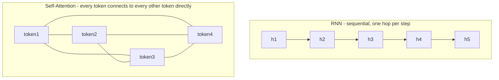

### 4.2 Self-attention — building the formula from intuition

> **Key Takeaway:** Attention(Q, K, V) = softmax(Q·Kᵀ / √d_k) · V — a differentiable, weighted "soft lookup": for each token, match its Query against every token's Key, then aggregate Values proportionally to relevance.

The core idea: for every token, decide how much "attention" (weight) to pay to every other token when building its updated representation, then combine information accordingly.

To do this, each token's embedding vector is projected, via three separate learned weight matrices, into three role-specific vectors:

- **Query (Q)** — "what am I looking for?" (a representation of the current token's information need)
- **Key (K)** — "what do I contain?" (a representation of what each token offers, to be matched against queries)
- **Value (V)** — "what information do I actually carry?" (the content that gets aggregated once relevance is determined)

```
Q = X · W_Q       K = X · W_K       V = X · W_V
```

where `X` is the matrix of input embeddings (one row per token) and `W_Q, W_K, W_V` are learned weight matrices. The Query/Key/Value split is itself a learned design: nothing forces `Q`, `K`, `V` to mean anything a priori, the model discovers, through training, projections that make this matching-and-aggregating mechanism useful for predicting the next token.

**Step 1 — Compute relevance scores.** Take the dot product of every query with every key:

```
scores = Q · Kᵀ
```

This produces a matrix where entry `(i, j)` measures how relevant token j's *content* is to token i's *information need* (a large dot product = well-aligned vectors = high relevance). Intuitively, this is analogous to a soft, differentiable lookup: instead of retrieving a single best-matching key (like a Python dictionary), attention retrieves a **weighted blend** of all values, weighted by how well each key matches the query.

**Step 2 — Scale.** Divide by `√d_k` (the square root of the key vector's dimension):

```
scaled_scores = (Q · Kᵀ) / √d_k
```

Why scale? As `d_k` grows, dot products of random vectors tend to grow in magnitude (variance of a dot product of two independent random vectors scales with dimension). Without scaling, scores could become very large, pushing the following softmax into regions where gradients are extremely small (the softmax saturates near one-hot outputs), hurting training stability. Dividing by `√d_k` keeps the variance of the scores roughly constant regardless of dimension, keeping the softmax gradient well-behaved.

**Step 3, Normalize into weights.** Apply softmax row-wise, so each token's attention weights over all other tokens sum to 1:

```
weights = softmax(scaled_scores)
```

**Step 4, Aggregate.** Multiply by V to get a weighted combination of value vectors:

```
Attention(Q, K, V) = softmax( Q·Kᵀ / √d_k ) · V
```

Putting it together, this single formula is the entire mechanism:

```
Attention(Q, K, V) = softmax( Q·Kᵀ / √d_k ) · V
```

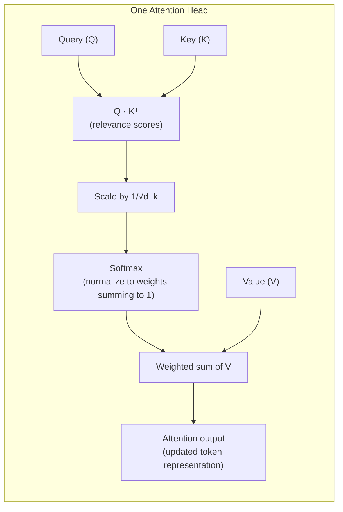

#### A tiny worked numerical example
Suppose we have just 2 tokens, and (for simplicity) `d_k = 2`. Say:

```
Q = [[1, 0],       K = [[1, 0],       V = [[10, 0],
     [0, 1]]            [0, 1]]            [0, 10]]
```

Step 1 (`Q·Kᵀ`):
```
[[1, 0],   [[1, 0],ᵀ   [[1, 0],
 [0, 1]] ·  [0, 1]]  =  [0, 1]]
```
Step 2 (scale by `1/√2 ≈ 0.707`):
```
[[0.707, 0],
 [0, 0.707]]
```
Step 3 (softmax, row-wise): row 1 becomes `[σ, 1−σ]` where `σ = e^0.707/(e^0.707+e^0) ≈ 0.67`, so:
```
weights ≈ [[0.67, 0.33],
           [0.33, 0.67]]
```
Step 4 (`weights · V`):
```
output row 1 ≈ 0.67·[10,0] + 0.33·[0,10] = [6.7, 3.3]
output row 2 ≈ 0.33·[10,0] + 0.67·[0,10] = [3.3, 6.7]
```
Notice token 1's output is dominated by its own value (because its query matched its own key most strongly) but still blends in a meaningful contribution from token 2, exactly the "soft lookup" behavior described above. In a real model this happens across all tokens simultaneously, for hundreds of dimensions, with values that are *learned*, not hand-set, but the mechanics are identical.

### 4.3 Multi-head attention

> **Key Takeaway:** Running several attention heads in parallel, each in its own learned subspace, lets the model capture multiple types of relationships (syntax, coreference, position) simultaneously instead of averaging them into one.
A single attention computation forces the model to average all types of relevance into one weighting scheme per token pair. In practice, useful relationships are diverse, syntactic agreement, coreference, positional adjacency, topical similarity, and a single head cannot represent all of them well simultaneously. **Multi-head attention** runs `h` independent attention computations ("heads") in parallel, each with its own learned `W_Q, W_K, W_V` projections into a smaller subspace, then concatenates and linearly recombines the results:

```
MultiHead(Q, K, V) = Concat(head_1, ..., head_h) · W_O
where head_i = Attention(Q·W_Q_i, K·W_K_i, V·W_V_i)
```

If the model dimension is `d_model` and there are `h` heads, each head typically operates in dimension `d_k = d_model / h`, so the total compute is comparable to one full-dimension attention pass, but the representation is split into `h` independent "perspectives." Empirically, when researchers inspect trained attention heads, some specialize in tracking adjacent tokens, others in long-range coreference, others in syntactic structure, the diversity is not designed by hand, it emerges from optimization because it's a more expressive use of the same parameter budget than one large head.

### 4.4 Positional encoding

> **Key Takeaway:** Self-attention alone is order-blind (permutation-invariant); positional encoding (sinusoidal in the original Transformer, RoPE in modern models) injects sequence-order information into the token representations.
Self-attention, as defined above, is **permutation-invariant**: nothing in the formula distinguishes "the dog bit the man" from "the man bit the dog", attention only sees a *set* of tokens, not a *sequence*, unless we explicitly inject order information. The original Transformer does this via fixed sinusoidal functions added to the input embeddings, one function per embedding dimension:

```
PE(pos, 2i)   = sin( pos / 10000^(2i/d) )
PE(pos, 2i+1) = cos( pos / 10000^(2i/d) )
```

where `pos` is the token's position in the sequence (0, 1, 2, …) and `i` indexes pairs of embedding dimensions. Each dimension oscillates at a different frequency, low dimensions oscillate quickly (encoding fine-grained relative position), high dimensions oscillate slowly (encoding coarse, long-range position), a bit like a binary clock, but continuous and smooth. Because sine/cosine functions have a fixed, well-defined relationship between positions (`PE(pos+k)` can be expressed as a linear function of `PE(pos)`), the model can, in principle, learn to attend based on *relative* position, not just absolute position.

This encoding is added element-wise to the token embedding before the first transformer layer:

```
input_to_layer_1 = token_embedding + positional_encoding
```

(See §4.7 for RoPE, the rotary positional encoding that has largely superseded this original sinusoidal scheme in modern models.)

### 4.5 The full transformer block

> **Key Takeaway:** Each block = self-attention → residual + normalization → feed-forward network → residual + normalization, stacked N times. Residual connections keep gradients flowing through very deep stacks.

A transformer isn't just attention, attention is followed by a position-wise feed-forward network, and both sub-layers are wrapped in **residual connections** and **layer normalization**:

```
sublayer_output = LayerNorm( x + Sublayer(x) )
```

- **Residual connection** (`x +`) — adds the sub-layer's *input* back to its *output*. This gives gradients a direct path backward through the network (bypassing the sub-layer entirely if needed), which is essential for training very deep stacks (tens to hundreds of layers) without vanishing gradients.
- **Layer normalization** — rescales each token's vector to have consistent mean/variance across its dimensions, stabilizing training dynamics layer to layer. (Modern models often use **RMSNorm**, a simplified variant, see §4.7.)

The **position-wise feed-forward network (FFN)** applies the same two-layer MLP independently to every token's vector:

```
FFN(x) = activation(x · W_1 + b_1) · W_2 + b_2
```

This is where a large fraction of a transformer's total parameters live, and, crucially for §5.4, it's the component that Mixture-of-Experts architectures replace with multiple parallel "expert" versions.

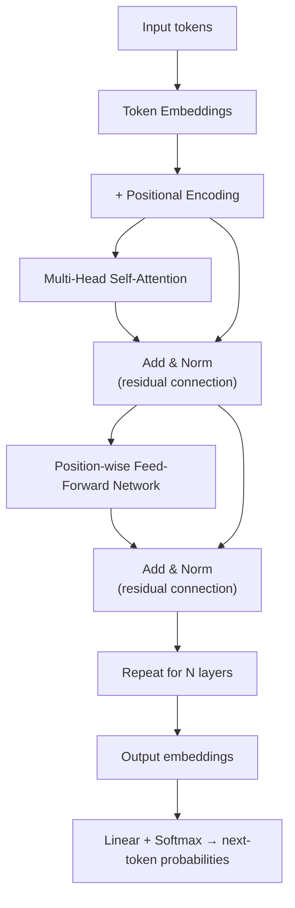

Each transformer block is: **self-attention → residual + normalization → feed-forward network → residual + normalization**, stacked N times. N ranges from a dozen layers in small research/teaching models to well over a hundred in frontier models; `d_model` (the width of each token's vector) similarly ranges from a few hundred to well over ten thousand.

### 4.6 Encoder-only vs. decoder-only vs. encoder-decoder

> **Key Takeaway:** Encoder-only = bidirectional understanding (classification, NER); Encoder-Decoder = sequence-to-sequence (translation, summarization); Decoder-only = causal, autoregressive generation. Decoder-only now dominates general-purpose LLMs because next-token prediction unifies every task as text generation.

The original Transformer paper used a full **encoder-decoder** design (for machine translation), but the field has since split into three families depending on the attention pattern and pretraining objective used.

| Type | Attention pattern | Pretraining objective | Best-suited tasks |
|---|---|---|---|
| **Encoder-only** (auto-encoding, e.g. BERT) | Bi-directional, every token sees every other token, including *future* tokens | Masked Language Modeling: randomly mask ~15% of tokens, predict them from the surrounding (bidirectional) context | Classification, sentiment analysis, NER, extractive QA, tasks needing full-sentence *understanding*, not generation |
| **Encoder-Decoder** (sequence-to-sequence, e.g. T5, BART) | Encoder: bi-directional over the input / Decoder: causal, and also attends to the full encoder output | Span corruption: mask contiguous spans of text, predict the missing spans | Summarization, translation, generative QA, tasks mapping one sequence to a *different* sequence |
| **Decoder-only** (autoregressive, e.g. GPT, Llama, Claude, Gemini) | Causal (masked), each token can only attend to itself and previous tokens, never future ones | Next-token prediction: predict token t+1 given tokens 1..t | Open-ended text generation, chat, code, reasoning, anything framed as "continue this text" |

**Why causal masking for decoder-only models?** During training, we want to predict *every* position in a sequence simultaneously (for efficiency), but a token must never be allowed to "see" the answer it's supposed to predict. This is enforced by adding `−∞` to the attention scores for any (query, key) pair where the key's position is *after* the query's position, before the softmax, so after normalization, those positions receive exactly zero attention weight. This is why decoder-only models are also called **autoregressive**: at generation time, each new token is produced conditioned only on the tokens generated so far, one at a time.

```mermaid
flowchart TB
    subgraph EO["Encoder-only - BERT-style"]
        EO1["Input (full sentence, some tokens masked)"] --> EO2["Bi-directional Encoder"]
        EO2 --> EO3["Classification / NER / QA"]
    end
    subgraph ED["Encoder-Decoder - T5-style"]
        ED1["Input sequence"] --> ED2["Encoder (bi-directional)"]
        ED2 --> ED3["Decoder (causal, cross-attends to encoder)"]
        ED3 --> ED4["Summarization / Translation"]
    end
    subgraph DO["Decoder-only - GPT-style"]
        DO1["Prompt"] --> DO2["Causal Decoder<br/>(each token sees only the past)"]
        DO2 --> DO3["Autoregressive generation,<br/>one token at a time"]
    end
```

> Since 2023–2024, virtually every frontier general-purpose LLM (GPT, Claude, Gemini, Llama, Qwen, DeepSeek) is **decoder-only**. Encoder-only and encoder-decoder models remain strong for specific discriminative or seq2seq tasks (embeddings, retrieval, translation), but decoder-only architectures dominate general-purpose generation for a simple reason: a single next-token-prediction objective can be applied uniformly to *any* task once it's phrased as text (classification becomes "predict the label word," translation becomes "predict the translated text," reasoning becomes "predict the next reasoning step"), this unification is what allows one architecture and one training recipe to scale to a general-purpose assistant.

### 4.7 Modern architectural refinements (up to 2026)

> **Key Takeaway:** RoPE, GQA/MQA, RMSNorm, SwiGLU, FlashAttention, and Mixture-of-Experts are the main efficiency upgrades separating a 2017 Transformer from a 2026 frontier model, same core math, far cheaper to train and serve.

The original 2017 Transformer has been substantially refined over the following years. Frontier models in 2026 typically combine several of the following:

- **RoPE (Rotary Position Embedding)** — instead of *adding* a fixed positional vector to the embedding (§4.4), RoPE *rotates* the Query and Key vectors by an angle proportional to their position, before computing the dot product. This has two advantages: the dot product between a rotated Q and rotated K naturally ends up depending only on their *relative* position (not their absolute positions), and it generalizes more gracefully to sequence lengths longer than those seen during training, which matters enormously for today's long-context models (context windows of hundreds of thousands to millions of tokens).
- **Grouped-Query Attention (GQA) / Multi-Query Attention (MQA)** — standard multi-head attention gives every head its own Key/Value projections, which means the "KV-cache" (the stored Keys/Values for all previous tokens, kept around during generation to avoid recomputation) grows proportionally to the number of heads. GQA shares one set of Key/Value projections across a *group* of Query heads (MQA is the extreme case: one shared K/V for *all* heads), shrinking the KV-cache substantially and speeding up inference, at a small, usually acceptable quality cost.
- **RMSNorm** instead of LayerNorm, LayerNorm re-centers *and* rescales activations; RMSNorm only rescales (by the root-mean-square of the activations), skipping the mean-centering step. This is computationally cheaper and empirically about as stable, so most modern models have switched to it.
- **SwiGLU / gated activations** instead of ReLU in the feed-forward block, a "gated" variant of the FFN where one linear projection multiplicatively gates another, consistently improving quality per parameter over the original ReLU-based FFN, at a modest extra compute cost.
- **FlashAttention** — a purely *engineering* (not mathematical) innovation: it computes the exact same attention formula, but restructures the computation to avoid ever materializing the full `(sequence_length × sequence_length)` attention matrix in slow GPU memory, instead fusing the operations and keeping intermediate results in fast on-chip memory. This yields large memory and speed improvements with zero change to the model's outputs.
- **Mixture-of-Experts (MoE)** — see §5.4: replaces the dense feed-forward block with many "expert" sub-networks and a router that activates only a few per token, decoupling total parameter count from per-token compute. By 2026 this is the dominant design for frontier open-weight models (e.g., DeepSeek-V4, Qwen3, Llama 4, Mistral Large 3, GLM-5.2), enabling trillion-parameter total capacity at a fraction of the inference cost of an equivalently-sized dense model.
- **Native multimodal routing** — rather than bolting a separately-trained vision encoder onto a text model, several 2025–2026 flagship models route different modalities (text, image, audio, video) through shared or specialized expert pathways from the very start of training (see §13.3).

### 📝 Exercise 4.1
Given `d_model = 512` and `h = 8` attention heads, what is `d_k` per head? If you switch to Grouped-Query Attention with 8 query heads sharing just 2 key/value head groups, by what factor does the KV-cache shrink compared to standard multi-head attention?

### 📝 Exercise 4.2
Explain why causal masking is unnecessary for encoder-only models like BERT, but essential for decoder-only models like GPT. What would happen during *training* of a decoder-only model if causal masking were removed by mistake?


---

## 5. Pretraining LLMs & Scaling Laws

> **Key Takeaway:** LLMs are pretrained by predicting the next token (cross-entropy loss) over massive text, a free, self-supervised signal that implicitly teaches grammar, facts, and reasoning. Chinchilla scaling laws show model size and training data should scale together for a fixed compute budget; Mixture-of-Experts decouples total model capacity from per-token compute cost.

### 5.1 The pretraining objective, in detail

> **Key Takeaway:** Minimizing next-token cross-entropy loss (reported as perplexity) is the entire pretraining signal, and it turns out to require the model to implicitly learn grammar, facts, and reasoning to do well.

Decoder-only LLMs are pretrained with a deceptively simple objective: given all previous tokens, predict the next one. Formally, the model outputs a probability distribution over the entire vocabulary for each position, and training minimizes the **cross-entropy loss** between that distribution and the true next token, averaged over a massive text corpus:

```
L = − (1/T) · Σ_t  log P(x_t | x_1, ..., x_{t-1})
```

where `T` is the sequence length and `P(x_t | x_<t)` is the model's predicted probability of the actual next token `x_t`. Minimizing this loss is equivalent to maximizing the log-likelihood the model assigns to the real training data, the model is pushed to become progressively better at guessing what comes next in real human-written text.

This is often reported as **perplexity**:

```
PPL = exp(L)
```

Perplexity has an intuitive reading: it's the effective number of equally-likely choices the model is "confused between" at each step. A perplexity of 1 means perfect, certain prediction; a perplexity equal to the vocabulary size means the model is no better than guessing uniformly at random. State-of-the-art LLMs achieve perplexities in the single digits on held-out natural text, remarkably low given the vocabulary size is tens of thousands of tokens, reflecting just how predictable well-formed language actually is.

**Why is next-token prediction such a powerful training signal?** It is, in effect, a form of unsupervised (self-supervised) learning: every sentence in existence is simultaneously an input and a label, with zero manual annotation required. Predicting the next token well for arbitrary text turns out to require the model to implicitly learn grammar, facts about the world, reasoning patterns, and stylistic conventions, because all of these are needed to predict human-written text accurately. This is why pretraining on a broad enough corpus produces a model with surprisingly general capabilities, despite the objective itself being narrow and mechanical.

### 5.2 Compute, tokens, and parameters

> **Key Takeaway:** Training compute ≈ 6 · N · D: model size (N) and dataset size (D) are two independent knobs whose product determines total compute spent.

Training compute for a dense transformer is well approximated by a simple rule of thumb:

```
C ≈ 6 · N · D
```

where `N` = number of (non-embedding) model parameters and `D` = number of training tokens. The constant `6` comes from counting floating-point operations: roughly `2·N` FLOPs per token for the forward pass (each parameter is involved in one multiply and one add per token), and roughly twice that again for the backward pass (`4·N`), giving `2N + 4N = 6N` FLOPs per token, times `D` tokens.

This formula makes explicit that **compute is the product of two independent knobs** — how big the model is, and how much data it sees, and a fixed compute budget can be spent by increasing either one, at the expense of the other.

### 5.3 Scaling laws (the "Chinchilla" result)

> **Key Takeaway:** For a fixed compute budget, model size and training-token count should grow in roughly equal proportion. Many early models (e.g. GPT-3) were under-trained relative to their size; smaller, more heavily-trained models can outperform them at equal compute.

Given a fixed compute budget `C`, how should you split it between model size `N` and dataset size `D`? Before 2022, the common assumption (following early scaling-law work, notably from OpenAI) was that model size mattered most, leading to models like the original 175B-parameter GPT-3 trained on a comparatively modest ~300B tokens.

DeepMind's *Training Compute-Optimal Large Language Models* paper (Hoffmann et al., 2022, the "Chinchilla" paper) revisited this question systematically, modeling the pretraining loss as a function of both model size and data size:

```
L(N, D) = E + A / N^α + B / D^β
```

where:
- `E` is an irreducible-loss constant, the entropy of natural language itself, a floor no model can beat regardless of size or data, since language has inherent unpredictability (multiple valid next words).
- `A / N^α` is the loss reduction from model capacity, bigger models can represent more, so this term shrinks as `N` grows.
- `B / D^β` is the loss reduction from data, more training examples improve the fit, so this term shrinks as `D` grows.
- `A, B, α, β` are empirical constants fitted from hundreds of training runs at varying scales.

The paper tested three independent methodologies to find the compute-optimal frontier:
1. **Fix model sizes, vary training tokens** — train several models of the same size on different amounts of data, find where loss is minimized for each compute budget.
2. **IsoFLOP profiles** — for several fixed compute budgets, train many models trading off size vs. data, and trace out the loss-minimizing combination at each budget.
3. **Fitting the parametric loss function directly** — fit `L(N,D)` above to all runs jointly, then solve analytically for the optimal `(N, D)` at any `C`.

All three approaches converged on the same qualitative conclusion:

> **For compute-optimal training, model size and training-token count should be scaled in roughly equal proportion.** Doubling your compute budget should roughly double *both* your parameter count and your token count, not overwhelmingly favor one over the other.

This meant many earlier models (notably the original GPT-3) were significantly **under-trained** relative to their parameter count: a much smaller model trained on proportionally more tokens (the Chinchilla model itself: 70B parameters trained on 1.4 trillion tokens, versus GPT-3's 175B parameters on ~300B tokens) achieved *better* downstream performance at *comparable* training compute, because that same compute was spent more efficiently, shrinking both loss terms in balance rather than over-investing in `N` while leaving `D` proportionally starved.

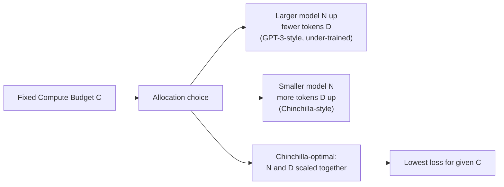

#### A worked numerical intuition
Suppose (illustratively, using rough Chinchilla-derived ratios) that a compute-optimal model trains on roughly 20 tokens per parameter. A 70B-parameter model would then be paired with roughly 1.4T training tokens (70B × 20 ≈ 1.4T), matching the actual Chinchilla configuration. A 7B-parameter model would compute-optimally pair with roughly 140B tokens. This "~20 tokens per parameter" heuristic became a widely cited rule of thumb after the paper's publication, even though the *precise* optimal ratio depends on the fitted constants and shifts somewhat with data quality and architecture.

**An important caveat for practice, and why 2026 models often deviate from Chinchilla-optimality:** Chinchilla optimizes *training* compute only. It says nothing about *inference* cost, and in production, a model is trained once but may serve billions of queries over its lifetime. Since 2023, many production models have been deliberately trained on **far more tokens than Chinchilla-optimal** ("over-trained" relative to pure training-compute efficiency), because a smaller model trained longer, while slightly less training-compute-efficient, is *cheaper and faster to serve* at a given quality level, and total inference cost over a model's lifetime routinely dwarfs its one-time training cost. This is a good example of why scaling laws are a powerful planning tool, but the objective you optimize for (training FLOPs vs. total cost of ownership including serving) changes the "optimal" answer.

### 5.4 Mixture-of-Experts (MoE) — decoupling capacity from compute

> **Key Takeaway:** MoE replaces one dense feed-forward network with many expert networks plus a router that activates only the top-k per token, trillion-parameter total capacity at a fraction of dense-model inference cost. This is the dominant 2026 frontier architecture.

A dense feed-forward network (§4.5) activates *all* of its parameters for *every* token, every parameter does a small amount of work on every single token processed. This is simple but wasteful: not every parameter is likely to be equally useful for every token.

An **MoE layer** instead replaces the single dense FFN with many parallel "expert" FFNs (each structurally identical to a normal FFN, but with independent weights) plus a small **router / gating network** that, for each token, scores all experts and activates only the top-k (commonly k = 1, 2, or 8):

```
MoE(x) = Σ_{i in TopK(router(x))}  g_i(x) · Expert_i(x)
```

where `router(x)` is typically a small linear layer producing a score per expert, `TopK` selects the highest-scoring k experts, and `g_i(x)` is the (softmax-normalized, over just the selected experts) gate weight determining how much each selected expert's output contributes.

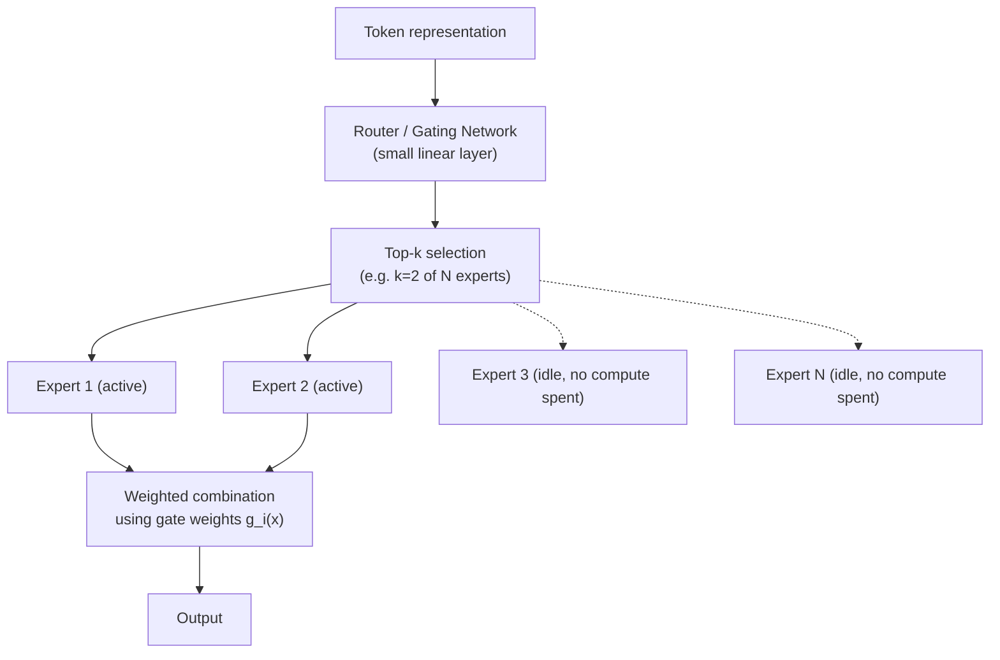

**Why this is powerful:** total parameter count (and hence model *capacity*, how much information the model can store and specialize across) can grow enormously by adding more experts, while per-token *compute* (and hence serving latency and cost) only grows with `k`, the small number of experts actually activated. A 700B-parameter MoE model with `k=2` active experts out of, say, 64 might only spend the compute of a ~40B dense model per token, while retaining far more total capacity to specialize across different types of input (different languages, domains, or reasoning patterns can be implicitly routed to different experts).

**Trade-offs and practical challenges of MoE, worth knowing:**
- **Training instability**: the router must learn to balance load reasonably evenly across experts; without care, the router can collapse to always favoring a handful of experts, wasting the extra capacity (mitigated with auxiliary load-balancing losses added to the training objective).
- **Memory vs. compute mismatch**: even though *compute* per token is small, *all* expert parameters must still be held in memory (typically distributed across many accelerators), since which experts get used varies token-to-token, this is why MoE models need substantial total accelerator memory even though inference FLOPs are modest.
- **Communication overhead** in distributed training/serving, since tokens must be routed to whichever device holds their selected experts.

By 2026, MoE is the default architecture behind essentially every frontier open-weight release (DeepSeek-V4, Qwen3-MoE, Llama 4, Mistral Large 3, Kimi K2, GLM-5.2), because empirically it delivers dense-model-beating quality at a fraction of the inference compute, a favorable trade for both providers (serving cost) and users (latency).

### 📝 Exercise 5.1
Using `C ≈ 6ND`, if you have a fixed compute budget of `C = 1e23` FLOPs, and you decide (Chinchilla-style) to use roughly 20 tokens per parameter, solve for `N` and `D`. (Hint: substitute `D = 20N` into the compute formula and solve for `N`.)

### 📝 Exercise 5.2
A dense 70B model and an MoE model with 700B total parameters but only 40B active parameters per token are compared. Which one requires more GPU *memory* to serve? Which one is likely *faster* per token generated? Explain the apparent paradox.


---

## 6. Prompt Engineering & In-Context Learning

> **Key Takeaway:** Large models can learn a new task from examples given directly in the prompt (zero/one/few-shot), with no weight updates at all. Chain-of-thought prompting gives the model more effective "space" to reason before committing to an answer.

Prompt engineering shapes model behavior purely through the input text, without updating any weights. It is the fastest and cheapest adaptation method, and, because it requires no training infrastructure, should generally be the first thing you try before considering fine-tuning (§8) or PEFT (§9).

### 6.1 In-Context Learning (ICL): the phenomenon

> **Key Takeaway:** Zero-shot = instruction only; one-shot = one example; few-shot = several examples. Larger models handle zero-shot well; smaller models often need fine-tuning rather than more examples.

A remarkable empirical discovery of large-scale language models (first documented at scale in the GPT-3 paper, *"Language Models are Few-Shot Learners,"* 2020) is that a sufficiently large pretrained model can learn to perform a *new* task from examples given directly *in the prompt*, with no gradient updates at all. This is called **in-context learning**, and it is distinct from fine-tuning: the model's weights never change; instead, the examples in the prompt act as a kind of temporary, implicit demonstration that the model conditions its next-token predictions on.

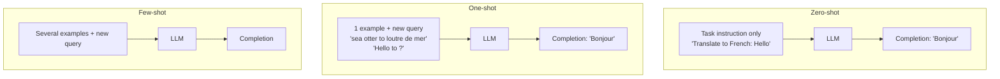

- **Zero-shot inference**: only the task instruction is given, no examples. Relies entirely on the model's pretrained understanding of the task from its instruction (and, for instruction-tuned models, its alignment training, see §8.2, §10).
- **One-shot inference**: one example question/answer pair is given, followed by the real question the model must answer. This gives the model a concrete demonstration of the expected input/output *format*, which is often more valuable than it might seem, much of what one-shot examples fix is ambiguity about output format (length, structure, style) rather than task understanding per se.
- **Few-shot inference**: several example pairs are given before the real question, further reducing ambiguity about the task and format, and often improving accuracy on tasks with subtle or unusual conventions.

**A crucial nuance**: larger models capture more general language understanding from pretraining and are surprisingly capable at *zero-shot* inference, often needing no examples at all for common tasks. **Smaller LLMs can struggle** with one-shot and few-shot inference; providing examples doesn't reliably help a small model the way it helps a large one, because the underlying capability the examples are meant to elicit may simply not be well-represented in a smaller model's pretrained knowledge. In such cases, fine-tuning on the target task (§8) is often more effective than accumulating more few-shot examples.

### 6.2 Prompt engineering as a design discipline

> **Key Takeaway:** Clear instructions, role/system framing, structured output requests, and task decomposition consistently improve reliability, without touching the model's weights.

Beyond ICL, effective prompting draws on several complementary techniques:

- **Clear, explicit instructions** — state the task, the desired output format, and any constraints directly, rather than relying on the model to infer intent.
- **Role/system framing** — establishing a persona or operating context ("You are an expert reviewer…") can shift the *style and register* of outputs, though it does not grant new factual knowledge.
- **Structured output requests** — asking for JSON, XML, or a specific schema, especially when the output will be parsed programmatically downstream (this matters enormously for the agentic tool-calling patterns in §14).
- **Decomposition** — breaking a complex request into smaller, explicitly sequenced sub-tasks, either within one prompt or across multiple calls, generally improves reliability over one large, vague request.

### 6.3 Chain-of-Thought (CoT) prompting

> **Key Takeaway:** Asking the model to reason step by step before answering gives it more effective computation and visible intermediate context, this idea is now trained directly into reasoning models via RLVR (§10.4).

Rather than asking directly for a final answer, chain-of-thought prompting asks the model to reason step by step *before* answering, either via an explicit instruction ("Let's think step by step") or by providing few-shot examples whose demonstrated answers include visible intermediate reasoning, not just a final result.

**Why does this work, mechanically?** A decoder-only model can only "compute" as much as it has token positions to compute in, each token's representation is produced by a fixed amount of feed-forward computation per layer, conditioned on everything generated so far. If you force the model to jump directly to a final answer, it has to perform any necessary multi-step reasoning "silently," compressed into the hidden states of a single token-generation step, often insufficient for problems that genuinely require several sequential reasoning steps (e.g., multi-step arithmetic, multi-hop logical deduction). By generating intermediate reasoning tokens explicitly, the model effectively gets *more* computation "budget," and, just as importantly, each reasoning step becomes visible context that later steps can condition on, turning what would be one large implicit leap into a sequence of smaller, more reliable inferential steps.

CoT measurably improves performance on arithmetic, logic, and multi-step reasoning tasks, and its core idea, spend more generated tokens on intermediate reasoning before committing to an answer, is now central to **reasoning models** (§10.3, §16), which are explicitly *trained* (via reinforcement learning with verifiable rewards) to generate long internal chains of thought before responding, rather than relying on the user to elicit this behavior through prompting alone.

### 6.4 Self-consistency and related techniques

> **Key Takeaway:** Sampling multiple independent reasoning chains and taking a majority vote trades extra inference compute for higher accuracy on hard reasoning tasks.
A related technique, **self-consistency**, samples multiple independent chains of thought for the same question (using non-zero temperature, §7) and takes the majority-vote final answer across samples, rather than trusting a single greedy chain of reasoning. This trades additional inference compute for higher accuracy on tasks where individual reasoning chains are sometimes wrong but errors are not perfectly correlated across samples, a simple example of the "more inference-time compute → better answers" trade-off that underlies much of modern reasoning-model and agentic design (§14).

### 📝 Exercise 6.1
Write a zero-shot prompt, a one-shot prompt, and a few-shot prompt (3 examples) for the task "classify the sentiment of a maintenance log entry as Normal, Warning, or Critical." Predict which formulation would likely perform best on a small (1–3B parameter) model versus a frontier-scale model, and justify your prediction using the ideas in §6.1.


---

## 7. Decoding Strategies

> **Key Takeaway:** Decoding strategy controls how predicted probabilities become actual output tokens: temperature reshapes the distribution's sharpness; greedy/top-k/top-p decide which token to pick from it. Low temperature + tight top-p suits deterministic tasks; higher temperature suits creative ones.

Prompt engineering controls *what* the model is asked; decoding strategy controls *how* the model turns its internal predictions into actual output text. These are configuration parameters invoked at inference time, entirely separate from the model's weights.

### 7.1 From logits to probabilities: the softmax and temperature

> **Key Takeaway:** Temperature reshapes the softmax output: T<1 sharpens (more deterministic), T>1 flattens (more random/creative). Token ranking never changes, only how concentrated the probability mass is.

At each generation step, the transformer's final linear layer produces one raw score (a **logit**) per vocabulary token, an unnormalized measure of how strongly the model favors that token as the next one. These logits are converted into a proper probability distribution via **softmax**, optionally reshaped by a **temperature** parameter `T`:

```
P(token_i) = exp(logit_i / T) / Σ_j exp(logit_j / T)
```

- **T = 1**: the unmodified distribution, softmax applied directly to the raw logits.
- **T < 1** (e.g., 0.3): *sharpens* the distribution. Dividing logits by a number smaller than 1 makes them larger in magnitude, and larger logit gaps translate into more extreme probability gaps after softmax, so the already-most-likely tokens become even more dominant, and generation becomes more deterministic, focused, and repetitive-leaning. As `T → 0`, this approaches greedy decoding (§7.2).
- **T > 1** (e.g., 1.5): *flattens* the distribution, smaller logit gaps after division mean probabilities become more uniform, giving lower-probability tokens a relatively higher chance of being sampled. This produces more varied, "creative," but also more error-prone and occasionally incoherent output, since even quite unlikely (and possibly poor) tokens gain a non-trivial chance of being chosen.

**Worked intuition:** suppose two candidate next tokens have logits 4.0 and 2.0 (a gap of 2.0). At `T=1`, softmax gives roughly 88%/12%. At `T=0.5` (dividing logits by 0.5, i.e. doubling the gap to 4.0), the split sharpens to roughly 98%/2%. At `T=2` (halving the gap to 1.0), it flattens to roughly 73%/27%. The *ranking* of tokens never changes with temperature, only how sharply probability mass concentrates on the top choices.

### 7.2 Choosing a token given the distribution

> **Key Takeaway:** Greedy picks the single most likely token; top-k keeps a fixed count of candidates; top-p (nucleus) adapts the candidate set size to the model's actual confidence at each step, generally the more robust default.

| Strategy | Rule | Typical use case |
|---|---|---|
| **Greedy decoding** | Always pick `argmax P(token)` | Deterministic tasks (classification, structured extraction, tool calls) where reproducibility matters more than variety; can be repetitive or get stuck in loops on open-ended generation |
| **Random sampling** | Sample a token according to the full probability distribution | Rarely used unmodified, the long tail of low-probability tokens can introduce incoherent choices |
| **Top-k sampling** | Restrict sampling to only the k tokens with highest probability, renormalize, then sample | Caps the "bad tail" at a fixed count; simple but doesn't adapt to how peaked or flat the distribution actually is at each step |
| **Top-p (nucleus) sampling** | Restrict sampling to the smallest set of tokens whose cumulative probability ≥ p, renormalize, then sample | Adapts dynamically: when the model is confident (one token dominates), the nucleus is small; when uncertain (many plausible tokens), the nucleus is larger, generally preferred over fixed top-k |
| **Max new tokens** | Hard cap on the number of tokens generated in the completion | Cost/latency control, preventing runaway generation |

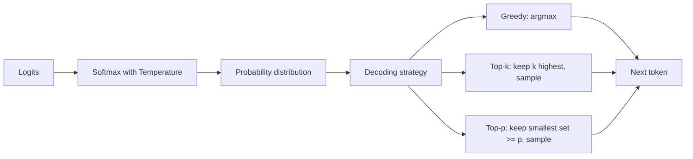

#### Worked example: top-k vs. top-p
Suppose after softmax the next-token distribution is: `A: 0.50, B: 0.20, C: 0.15, D: 0.10, E: 0.05` (five tokens, summing to 1.0).

- **Top-k with k=2**: keep only `{A, B}` (the two highest), renormalize to `A: 0.71, B: 0.29`, sample from just these two.
- **Top-p with p=0.7**: accumulate probabilities in order until the running total reaches 0.7: `A (0.50)` → running total 0.50; add `B (0.20)` → running total 0.70. The nucleus is `{A, B}`, same result as top-k=2 in this particular case, purely by coincidence of these numbers.

Now suppose instead the distribution were flatter: `A: 0.25, B: 0.22, C: 0.20, D: 0.18, E: 0.15`. Top-k=2 would still only keep `{A, B}` (0.47 of the total probability mass, discarding over half). Top-p=0.7 would need to include `A, B, C` (0.25+0.22+0.20=0.67, still short) and then `D` (0.85) to cross the 0.7 threshold, keeping 4 of 5 tokens, because the distribution is genuinely uncertain across many plausible options. This illustrates precisely why top-p tends to behave better than a fixed top-k across the wide range of distribution shapes a model produces across different generation steps: it adapts the "nucleus" size to how confident the model actually is at each step, rather than using a one-size-fits-all cutoff count.

### 7.3 Practical decoding recipes

> **Key Takeaway:** Real pipelines mix settings by purpose: low temperature for deterministic tool calls/code, higher temperature for creative writing, and repeated sampling with a verifier ("best-of-n") for hard reasoning problems.
Modern reasoning and agentic pipelines rarely use one fixed setting throughout; they mix strategies by purpose:
- **Low temperature + tight top-p** (e.g., T=0.2, p=0.9) for deterministic, structured outputs, tool calls, code, data extraction, where consistency and correctness matter more than variety.
- **Higher temperature** (e.g., T=0.7–1.0) for open-ended creative writing or brainstorming, where diversity of output is desirable.
- **Repeated sampling with a verifier** ("best-of-n"), generate several candidate completions (often at moderate-to-high temperature for diversity), then use a separate scoring mechanism (a reward model, a unit test, majority voting via self-consistency §6.4) to select or synthesize the best one. This trades additional inference compute for higher reliability, and is a foundational technique behind modern reasoning models' strong performance on hard problems.

### 📝 Exercise 7.1
Given logits `[3.0, 2.5, 1.0, 0.5]` for four candidate tokens, compute the softmax probabilities at `T=1`, `T=0.5`, and `T=2`. What is the top-p=0.9 nucleus at each temperature?


---

## 8. Fine-Tuning

> **Key Takeaway:** Fine-tuning updates a pretrained model's weights on new data, needing far less data/compute than training from scratch. Full fine-tuning on a narrow task risks catastrophic forgetting, degrading unrelated capabilities, mitigated by multi-task training or PEFT (§9).

### 8.1 Definition and motivation

> **Key Takeaway:** Fine-tuning adapts an already broadly-capable pretrained model to a new task/dataset, rather than starting from random weights, much cheaper in data and compute than training from scratch.

**Fine-tuning** updates the weights of a pre-trained LLM on a new task or dataset. This is fundamentally different from training from scratch: training from scratch starts from a randomly initialized model dedicated to one particular task and dataset, requiring enormous amounts of data and compute to reach any useful capability at all. Fine-tuning instead starts from a model that has already, through pretraining (§5), encoded broad language understanding, world knowledge, and reasoning patterns, so it typically requires far less task-specific data and compute to reach strong performance on a narrower target task.

Goals of fine-tuning:
- **Better understanding of prompts** specific to your domain or format (e.g., internal jargon, unusual input structures).
- **Better task completion** — higher accuracy, better adherence to a required output format, fewer irrelevant digressions.
- **More natural-sounding language** in a specific register, tone, or style (e.g., matching a company's brand voice, or a specific technical writing convention).

### 8.2 Instruction fine-tuning

> **Key Takeaway:** Training on many diverse prompt-completion pairs phrased as instructions turns a raw "base model" (which just continues text) into an instruction-following "chat/assistant model."

A raw pretrained model (sometimes called a **base model**) is only trained to continue text plausibly, given "The capital of France is," it will likely continue with "Paris," but given "What is the capital of France?" a base model might just as plausibly continue with more questions, rather than answering, because that's a statistically common continuation pattern in raw web text (e.g., a quiz page).

**Instruction fine-tuning** solves this: rather than fine-tuning on a single narrow task, the model is fine-tuned on a large, diverse collection of *prompt-completion pairs explicitly phrased as instructions and their correct responses*, spanning many different task types simultaneously (question-answering, summarization, classification, code generation, conversation, and so on, e.g., the FLAN collection). This teaches the model to generalize the *behavior* of following an instruction, rather than merely memorizing answers to the specific instructions seen during fine-tuning. This step is essentially what turns a raw pretrained "base model" into an instruction-following "chat model" or "assistant model", the foundation that subsequent alignment techniques (§10) build further on top of.

### 8.3 Catastrophic forgetting

> **Key Takeaway:** Full fine-tuning updates every parameter, so gradient updates for a new narrow task can silently overwrite weights that encoded other, previously-learned capabilities.

Fine-tuning a model on a single, narrow task can improve performance specifically on that task, but it can also **degrade performance on other tasks** as a side effect. This phenomenon is known as **catastrophic forgetting**, and it is one of the central practical challenges in adapting large pretrained models.

**Why does it happen?** Full fine-tuning updates *every* parameter in the model via gradient descent on the new task's loss. Nothing in that process protects the specific configurations of weights that encoded other capabilities learned during pretraining, if the gradient signal from the new, narrow task pulls a weight in a direction that happens to be useful for the new task but harmful for some other previously-learned behavior, that weight simply moves, and the old capability degrades, sometimes severely, especially if the fine-tuning dataset is small and the fine-tuning process runs for many steps or at a high learning rate (increasing how far weights move from their pretrained values).

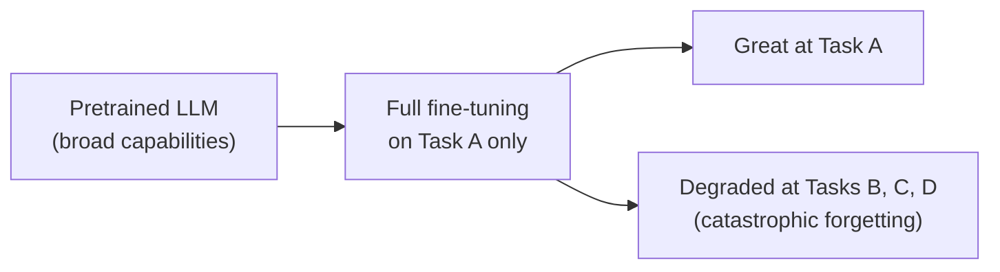

**Mitigations:**
- **Multi-task / instruction fine-tuning** — fine-tune on a diverse mixture of tasks simultaneously (rather than one narrow task in isolation), so no single skill's gradient signal dominates the updates and other capabilities are continually reinforced alongside the new one.
- **Parameter-Efficient Fine-Tuning (PEFT)** — freeze the vast majority of the original weights and only train a small number of new or modified parameters (see §9). Since most of the pretrained weights never change, most pretrained capabilities are structurally protected from being overwritten.
- **Lower learning rates and fewer training steps/epochs** — reduces how far any given weight is allowed to move from its pretrained value, at the cost of potentially slower or less complete adaptation to the new task.
- **Held-out regression testing** — routinely evaluate a fine-tuned checkpoint not just on the target task, but on a broad suite of other tasks/benchmarks, to catch forgetting early before deployment.

### 8.4 A practical fine-tuning workflow

> **Key Takeaway:** Define success criteria → curate and split data → choose full fine-tuning vs. PEFT → train while monitoring for forgetting → evaluate against baselines → deploy with ongoing monitoring.
1. **Define the task and success criteria precisely** — what does "correct" output look like, and how will you measure it?
2. **Curate a labeled dataset** of prompt-completion pairs representative of the target task and its expected input diversity (including edge cases).
3. **Split into train/validation/test sets** — never tune on your test set.
4. **Choose full fine-tuning vs. PEFT** (§9) based on your compute budget, need to support multiple tasks/tenants from one base model, and forgetting-risk tolerance.
5. **Train, monitoring both target-task loss/metrics and a regression suite** for catastrophic forgetting.
6. **Evaluate against baselines**: the pretrained/instruction-tuned model with prompt engineering alone, and (if relevant) previous fine-tuned checkpoints.
7. **Deploy with monitoring** — real-world input distributions drift, and a model fine-tuned on last year's data may degrade on this year's inputs.

### 📝 Exercise 8.1
You fine-tune a general assistant model on a narrow dataset of terse, bullet-point-only technical summaries for six months of internal reports. After fine-tuning, users complain the model now writes bullet points even when asked for a flowing narrative email. Diagnose what happened, and propose two different mitigations discussed in §8.3, explaining the trade-off each involves.


---

## 9. Parameter-Efficient Fine-Tuning (PEFT)

> **Key Takeaway:** Full fine-tuning is expensive in compute, memory, and storage. PEFT (e.g., LoRA: W = W0 + B·A) trains only a small fraction of parameters, often under 1%, cutting all three costs while roughly preserving task performance and structurally protecting against catastrophic forgetting.

### 9.1 Motivation

> **Key Takeaway:** PEFT directly attacks full fine-tuning's three costs, compute (gradients/optimizer state), memory, and storage (one full model copy per task), by freezing almost all pretrained weights.

Full fine-tuning of a multi-billion-parameter model is expensive along three dimensions simultaneously:
- **Compute**: gradients and optimizer states must be computed and stored for *every* parameter (for the common Adam optimizer, this means storing two additional floating-point numbers per parameter beyond the weight itself, roughly tripling memory just for optimizer state, on top of the model weights and activations).
- **Memory**: a full-size model, its full-size gradients, and its full-size optimizer state must all fit in accelerator memory simultaneously during training.
- **Storage/deployment**: if you need the model to perform well on `k` different tasks or customers, full fine-tuning naively requires storing and potentially serving `k` full copies of the model.

**PEFT** methods fine-tune only a small subset of parameters while freezing the rest of the pre-trained network, directly addressing all three costs:
- mitigates catastrophic forgetting (most weights are untouched, so most pretrained capability is preserved, see §8.3),
- cuts computational cost (only a small fraction of weights need gradients/optimizer state, often well under 1% for LoRA),
- cuts storage cost (only the small trainable delta needs to be stored per task, not a full model copy, often megabytes instead of gigabytes),
- **roughly preserves — but does not necessarily improve — final task performance** compared to full fine-tuning; the goal of PEFT is efficiency, not a quality upgrade over full fine-tuning (though in low-data regimes, PEFT's implicit regularization from touching fewer parameters can sometimes reduce overfitting compared to full fine-tuning).

### 9.2 PEFT method families

> **Key Takeaway:** Three families: Selective (train a subset of existing weights), Reparameterization (learn a compact low-rank update, LoRA), and Additive (insert new small trainable modules, adapters, prompt/prefix tuning).

| Category | Idea | Examples |
|---|---|---|
| **Selective** | Fine-tune only a chosen subset of *existing* parameters/layers, leaving everything else untouched | BitFit (only the bias terms), fine-tuning just the top few layers |
| **Reparameterization** | Represent the *update* to existing weights with a low-rank/compact parameterization, rather than a full-rank update | **LoRA**, QLoRA |
| **Additive** | Freeze the entire pretrained model and insert small *new* trainable modules | Adapters, Prompt Tuning, Prefix Tuning |

### 9.3 LoRA (Low-Rank Adaptation) — the math, in depth

> **Key Takeaway:** LoRA freezes W0 and learns a low-rank update W = W0 + B·A (rank r ≪ d,k), often training well under 1% of a matrix's parameters, mergeable into W0 at inference with zero added latency.

LoRA is grounded in an empirical observation from prior research: the *change* in weights needed to adapt a large pretrained model to a new task tends to have a low "intrinsic rank", meaning the update can be well-approximated by a much lower-dimensional transformation than the full weight matrix's dimensions would suggest, without much loss in adaptation quality.

Concretely: instead of updating the full weight matrix `W0` (of shape d×k) directly, LoRA freezes `W0` entirely and learns a **low-rank decomposition** of the *update* to it:

```
W = W0 + ΔW = W0 + B·A
where B is (d×r),  A is (r×k),  r << min(d, k)
```

`r` (the rank) is a hyperparameter, typically chosen between 4 and 64, far smaller than typical values of `d` or `k` (which can be in the thousands to tens of thousands for a large model's weight matrices). `A` is usually initialized with small random values, and `B` is initialized to all zeros, so at the very start of fine-tuning, `B·A = 0` and the model behaves *identically* to the unmodified pretrained model, and training gradually "grows" the adaptation from there. Only `A` and `B` are trained via backpropagation; `W0` never changes throughout the entire fine-tuning process.

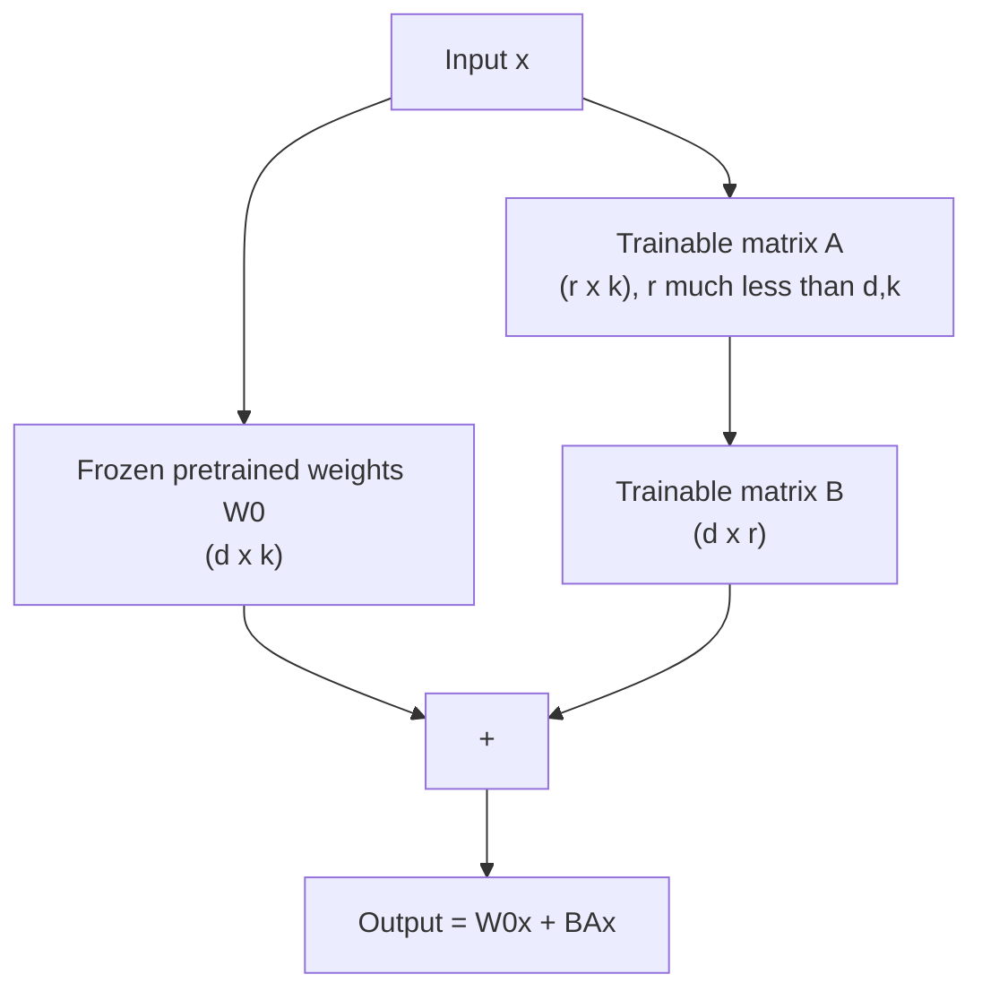

#### Worked parameter-count example
Suppose a weight matrix `W0` in a large model has shape `d = 4096, k = 4096` (a typical attention projection matrix size). Full fine-tuning of this one matrix would require training `4096 × 4096 ≈ 16.8 million` parameters. With LoRA at rank `r = 8`:

```
B: 4096 × 8 = 32,768 parameters
A: 8 × 4096 = 32,768 parameters
Total trainable: 65,536 parameters
```

That's roughly **0.4% of the full matrix's parameter count** — a >250x reduction for this single matrix, while typically retaining most of the adaptation quality full fine-tuning would achieve. Multiplied across all the attention and feed-forward matrices in a multi-billion-parameter model, LoRA fine-tuning commonly trains well under 1% of total parameters.

At inference time, `B·A` can be **merged back into `W0`** (`W_merged = W0 + B·A`, computed once) with **zero added latency** compared to the original model, or, alternatively, kept as a separate small adapter, allowing many different task-specific LoRA adapters (each just a few megabytes) to be swapped in and out of a single shared base-model deployment, dramatically reducing the storage and serving cost of supporting many fine-tuned variants.

**QLoRA** extends this further by **quantizing the frozen base model** to 4-bit precision (using a specially designed data type, NF4, tuned for the typical distribution of neural network weights) while keeping the small LoRA adapters (`A`, `B`) in higher precision (e.g., 16-bit) for stable gradient computation. This dramatically reduces the memory footprint of the *frozen* portion of the model, which is by far the largest part, making it possible to fine-tune models with tens of billions of parameters on a single consumer or prosumer-grade GPU that could never hold the full-precision model plus training state simultaneously.

### 9.4 Other additive PEFT methods

> **Key Takeaway:** Prompt tuning learns soft prompt embeddings; prefix tuning extends this to every attention layer; adapters insert small trainable bottleneck layers inside each block, all while the base model stays fully frozen.

- **Prompt Tuning** — learns a small set of continuous, trainable "soft prompt" embedding vectors, prepended to the input sequence's embeddings; the entire rest of the model is frozen and unchanged. Crucially, note this is *not* the same as manually writing a text prompt (§6), the soft prompt is not decodable back into words; it is a set of numerical vectors optimized directly via gradient descent to steer the frozen model toward the desired behavior, existing purely in embedding space.
- **Prefix Tuning** — extends the same idea deeper into the network: rather than only prepending trainable vectors to the input embeddings, it learns trainable key/value vectors that are prepended at *every* attention layer, not just the first. This gives the adaptation more expressive influence throughout the network's depth, at the cost of more trainable parameters than plain prompt tuning.
- **Adapters** — small bottleneck feed-forward layers (down-project, non-linearity, up-project) inserted *inside* each transformer block (e.g., after the attention or feed-forward sub-layer), trained while the original pretrained weights around them stay entirely frozen.

### 9.5 Choosing among PEFT methods

> **Key Takeaway:** LoRA/QLoRA are the default starting point in 2026 practice; the right choice depends on GPU memory constraints and how much inference-time overhead is acceptable.

| Method | Trainable params | Inference-time overhead | Notes |
|---|---|---|---|
| LoRA | Small (~0.1–1%) | None (can be merged) | Most widely used; good default choice |
| QLoRA | Small (~0.1–1%) | None (can be merged) | Best choice under tight GPU memory constraints |
| Prompt Tuning | Very small | Small (longer effective sequence) | Effective mainly at very large model scale |
| Prefix Tuning | Small-moderate | Small (longer effective sequence per layer) | More expressive than prompt tuning, more parameters |
| Adapters | Small-moderate | Small (extra layers in forward pass) | Cannot be merged away entirely; adds a fixed inference cost |

PEFT overall can reduce fine-tuning memory requirements to roughly **12–20%** of what full fine-tuning would need, at a typically small and task-dependent quality trade-off relative to full fine-tuning, making it, in 2026 practice, the default starting point for adapting large pretrained models rather than the exception.

### 📝 Exercise 9.1
A weight matrix has shape `d=8192, k=8192`. Compute the number of trainable parameters for LoRA at rank `r=4`, `r=16`, and `r=64`. At what rank would LoRA's parameter count equal 1% of full fine-tuning's parameter count for this matrix?

### 📝 Exercise 9.2
Explain, using the ideas from §8.3 and §9.1, why LoRA fine-tuning is structurally less prone to catastrophic forgetting than full fine-tuning, be specific about *which* parameters change and which don't.


---

## 10. Aligning Models with Human Feedback

> **Key Takeaway:** Pretraining and instruction tuning don't directly optimize for what humans prefer. RLHF trains a reward model from human preference rankings, then uses RL (PPO) to optimize the policy against it with a KL penalty. DPO achieves the same objective via one closed-form loss on preference pairs, no reward model or RL loop. RLVR uses automatic, verifiable rewards (math, code) and underlies modern reasoning models.

### 10.1 Why alignment is needed beyond instruction fine-tuning

> **Key Takeaway:** Following instructions correctly is not the same as being genuinely preferred by humans (helpful, honest, well-formatted, appropriately cautious), alignment closes that specific gap.

Pretraining (§5) teaches a model to predict plausible text; instruction fine-tuning (§8.2) teaches it to follow instructions in a consistent format. Neither step directly optimizes for what humans actually *prefer* among several plausible, instruction-following responses: which is more helpful, more honest, more harmless, better formatted, less verbose, appropriately cautious. **Alignment** techniques close this gap by directly incorporating human (or AI-generated) preference signals into training.

### 10.2 The classical RLHF pipeline, step by step

> **Key Takeaway:** SFT (demonstrations) → Reward Model (trained on human preference rankings via Bradley-Terry loss) → PPO (optimize the policy against the reward model, with a KL penalty to the SFT model to prevent reward hacking).

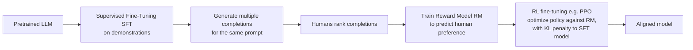

**Stage 1 — Supervised Fine-Tuning (SFT).** Start from a pretrained base model and fine-tune it on a (comparatively small, high-quality) set of human-written demonstrations of desired behavior, this is essentially the instruction fine-tuning step from §8.2, and produces the reference/starting policy for the following stages.

**Stage 2 — Reward Model (RM) training.** For a set of prompts, the SFT model generates *several* different candidate completions. Human annotators then *rank* these completions from best to worst (ranking is generally easier and more reliable for humans than assigning absolute numerical scores). This preference data trains a separate model, the reward model, to predict a scalar score reflecting how much a human would prefer a given completion.

The standard formulation uses the **Bradley-Terry model** of pairwise preferences: given a "winning" completion `y_w` and a "losing" completion `y_l` for the same prompt `x`, the reward model `r_φ` is trained so that its score for the winner tends to exceed its score for the loser, using a pairwise logistic loss:

```
L_RM(φ) = − log σ( r_φ(x, y_w) − r_φ(x, y_l) )
```

where `σ` is the logistic sigmoid function. Minimizing this loss pushes `r_φ(x, y_w)` to be larger than `r_φ(x, y_l)`, the reward model learns to *score* text the way human raters *preferred* it, without needing an absolute, calibrated notion of "quality," only a relative ordering.

**Stage 3 — Policy optimization via reinforcement learning.** With a trained reward model in hand, the LLM itself (now called the "policy," `π_θ`) is further trained, classically using **Proximal Policy Optimization (PPO)** — to generate completions that the reward model scores highly. But naively maximizing the reward model's score alone is dangerous: the policy can learn to exploit quirks or blind spots of the (imperfect, learned) reward model, producing text that scores highly according to `r_φ` but that is actually degenerate, repetitive, or nonsensical to an actual human (a failure mode called **reward hacking**). To prevent this, the training objective includes a **KL-divergence penalty** that keeps the policy's output distribution close to the original SFT model's distribution:

```
objective(θ) = E[ r_φ(x, y) ] − β · KL( π_θ(y|x) ‖ π_SFT(y|x) )
```

The `β` coefficient controls the trade-off: too small, and the policy can drift far from sensible language to over-optimize the reward model; too large, and the policy barely moves from the SFT starting point, limiting how much alignment improvement is achievable.

**A few important properties of RLHF worth internalizing:**
- It **preserves the original model architecture** and does not directly affect inference latency, RLHF changes *what* the model tends to say, not the computational cost of saying it.
- It can improve **interpretability of behavior indirectly**: since human raters tend to prefer responses that explain their reasoning or acknowledge uncertainty appropriately, reward signals that capture these preferences push the model toward producing more legible, checkable outputs, though this is a byproduct of the preference data used, not a guaranteed property of RLHF in general.
- It is an **online** learning process: the policy generates *new* completions during RL training (not just completions from a fixed, pre-collected dataset), and is scored and updated iteratively, this online exploration is part of what makes RLHF powerful for open-ended objectives, but also part of what makes it complex and comparatively expensive to run well.

### 10.3 Direct Preference Optimization (DPO)

> **Key Takeaway:** DPO reformulates RLHF's objective as a single closed-form classification loss over static (winner, loser) preference pairs, no separate reward model, no online RL loop, simple and stable to train.

RLHF's reward-model-plus-PPO pipeline is powerful but has real practical costs: it requires training and maintaining a *separate* reward model, running an online reinforcement learning loop (which is notoriously sensitive to hyperparameters and prone to instability), and repeatedly sampling from the policy during training, all of which add engineering complexity and compute cost compared to standard supervised fine-tuning.

**DPO** (Rafailov et al., 2023) makes a key mathematical observation: under the Bradley-Terry preference model, the *optimal* policy resulting from the full RLHF objective (reward maximization plus KL penalty) has a known closed-form relationship to the reward function. This means the *same* preference-alignment objective RLHF pursues indirectly (via an explicit reward model and RL) can be achieved by directly optimizing a single, closed-form loss over static preference pairs, no separate reward model, no reinforcement learning loop, no online sampling:

```
L_DPO(θ) = − log σ( β · [ log(π_θ(y_w|x)/π_ref(y_w|x)) − log(π_θ(y_l|x)/π_ref(y_l|x)) ] )
```

Here, `π_ref` is a frozen reference policy (typically the SFT model, exactly as in RLHF's KL penalty), and `π_θ` is the policy being trained. The term inside the brackets compares, for both the winning and losing completions, how much more (or less) likely the *current* policy makes that completion relative to the *reference* policy. The loss pushes this "relative preference for the winner" to be larger than the "relative preference for the loser," under the sigmoid-logistic loss structure familiar from Stage 2 of RLHF above.

Practically, DPO training looks just like ordinary supervised fine-tuning: you need a fixed dataset of `(prompt, winning completion, losing completion)` triples, and you run standard gradient descent on this loss, no reward model, no RL loop, no repeated online sampling from the policy during training. This dramatically simplifies the alignment pipeline while, under the Bradley-Terry assumption, targeting mathematically the same underlying alignment objective that RLHF's more complex pipeline pursues indirectly.

### 10.4 Beyond DPO: RLVR and the 2026 alignment landscape

> **Key Takeaway:** RLVR uses a rule-based, automatically verifiable reward (correct/incorrect) instead of a learned reward model, no reward hacking risk, and is the core technique behind training modern reasoning models. 2026 alignment pipelines are typically hybrid: SFT → DPO → RLVR.

DPO's simplicity comes with a real limitation: it is fundamentally an **offline** method, optimizing over a *fixed* dataset of preference pairs collected in advance. Its performance ceiling is bounded by how well that fixed dataset covers the space of situations the model will encounter, it cannot discover and correct novel failure modes that only emerge once the model is deployed, the way an online RL loop that continues sampling and receiving feedback in principle can.

For domains where correctness can be checked **automatically** and objectively, mathematics, code (via unit tests), certain logic puzzles, tool-use correctness, a different approach has become central to training modern reasoning models: **RLVR (Reinforcement Learning with Verifiable Rewards)**. Instead of a learned reward *model* (imperfect, and hackable, as discussed in §10.2), RLVR uses a simple, rule-based **verifier**: does the final answer match the known correct answer? Did the generated code pass the unit tests? This sidesteps the entire reward-hacking concern from classical RLHF, since the reward signal is an objective, ground-truth check rather than a learned approximation of human preference, the model cannot "trick" a unit test the way it might exploit blind spots in a learned reward model. RLVR is the core technique behind training models to produce long, effective chains of thought (§6.3) before answering, since the RL process directly rewards chains of thought that *lead to verifiably correct final answers*, reinforcing useful reasoning patterns and discouraging unproductive ones through pure trial and error at scale.

| Method | Type | Strengths | Limitations |
|---|---|---|---|
| **RLHF (PPO)** | Online RL, learned reward model | Handles multi-objective/sparse rewards well; continues improving beyond a fixed dataset via online exploration | Complex, unstable, expensive; needs a separate reward model prone to reward hacking |
| **DPO** and variants (IPO, KTO, SimPO, ORPO) | Offline, RL-free | Simple, stable, cheap; now the default for most production alignment | Bounded by preference-dataset coverage; weaker on tasks needing exploration or online correction |
| **RLVR** (RL with Verifiable Rewards) | Online RL, rule-based/verifiable reward | No learned reward model needed where a ground-truth checker exists (math, code, unit tests); avoids reward hacking; core technique behind modern reasoning models | Only applies where answers are automatically and objectively verifiable, not usable for open-ended style/tone/helpfulness alignment |

By 2026, alignment pipelines are typically **hybrid**, combining several of these stages rather than relying on just one: instruction SFT establishes baseline instruction-following, DPO (or a DPO variant) handles general preference alignment (helpfulness, tone, safety) cheaply and stably over curated preference data, and RLVR is layered on top specifically for domains with checkable correctness (math, coding, tool use) to build strong reasoning ability. Classical RLHF/PPO is increasingly reserved for narrower cases genuinely needing continual online adaptation or delicate multi-objective control that a fixed offline dataset cannot capture well.

### 📝 Exercise 10.1
A team wants to align a customer-support model to (a) never reveal internal pricing formulas and (b) write concise, friendly responses. Which of these two goals is a better candidate for RLVR versus DPO/RLHF-style preference alignment? Justify your answer using the definitions in §10.4.

### 📝 Exercise 10.2
Explain, in your own words, why DPO does not need a separate reward model, using the closed-form relationship between the RLHF objective and the optimal policy referenced in §10.3 (you do not need to derive it, describe the intuition).

---

## 11. Retrieval-Augmented Generation (RAG)

> **Key Takeaway:** RAG grounds generation in externally retrieved, up-to-date evidence at inference time, via embedding similarity search over a chunked knowledge base, instead of relying solely on the model's frozen, imprecise parametric memory. Far cheaper to update than fine-tuning: you edit the knowledge base, not the model.

### 11.1 The problem RAG solves

> **Key Takeaway:** An LLM's knowledge is frozen at its training cutoff and encoded imprecisely in its weights, leading to hallucination on gaps; RAG supplies fresh, external, citable evidence at inference time instead.

An LLM's knowledge is frozen at the end of pretraining (its **knowledge cutoff**) and is entirely encoded, implicitly and imprecisely, inside its weights, it cannot cite a source, cannot be selectively updated for one fact without retraining, and will confidently generate plausible-sounding but false statements (**hallucinations**) when its parametric memory is incomplete or wrong. RAG addresses this by giving the model access to external knowledge **at inference time**, without retraining, by retrieving relevant text and inserting it directly into the prompt as grounding context.

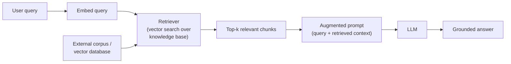

### 11.2 How retrieval works, mechanically

> **Key Takeaway:** Index once: chunk documents, embed each chunk, store in a vector DB. At query time: embed the query, retrieve the most similar chunks via cosine similarity, insert them into the prompt as grounding context.

**Step 1 — Indexing (done once, offline, ahead of time).** The knowledge base (documents, manuals, tickets, reports…) is split into **chunks** — typically a few hundred to a couple thousand tokens each, small enough to be a focused, self-contained unit of context, but large enough to retain meaning without excessive fragmentation. Each chunk is passed through an **embedding model** (a model, often much smaller than a generative LLM, specifically trained to produce a single dense vector summarizing a passage's meaning) to produce a vector, and all vectors are stored in a **vector database** alongside the original text.

**Step 2 — Retrieval (done per query, online).** The user's query is embedded using the *same* embedding model, producing a query vector in the same vector space as the indexed chunks. The retriever then finds the chunks whose vectors are most similar to the query vector, most commonly via **cosine similarity**:

```
similarity(q, d) = (q · d) / (‖q‖ · ‖d‖)
```

Cosine similarity measures the angle between two vectors, ignoring their magnitude, this matters because it makes retrieval robust to differences in passage length or overall vector "energy," focusing purely on *directional* alignment in the embedding space, which is what the embedding model was trained to make meaningful.

**Step 3 — Augmentation and generation.** The top-k most similar chunks are inserted into the prompt as context, typically with an instruction like "answer the question using only the following context," and the LLM generates its final answer conditioned on both the user's question and the retrieved evidence.

#### A minimal RAG implementation, illustrated in pseudocode

```python
import numpy as np

def cosine_similarity(a, b):
    return np.dot(a, b) / (np.linalg.norm(a) * np.linalg.norm(b))

def chunk_text(document, chunk_size=500, overlap=50):
    """Split a document into overlapping chunks (overlap avoids
    losing context that spans a chunk boundary)."""
    chunks = []
    start = 0
    while start < len(document):
        end = start + chunk_size
        chunks.append(document[start:end])
        start += chunk_size - overlap
    return chunks

# --- Offline indexing step ---
chunks = []
vectors = []
for doc in knowledge_base:
    for chunk in chunk_text(doc):
        chunks.append(chunk)
        vectors.append(embedding_model.embed(chunk))

# --- Online retrieval step ---
def retrieve(query, k=3):
    q_vec = embedding_model.embed(query)
    scores = [cosine_similarity(q_vec, v) for v in vectors]
    top_k_idx = np.argsort(scores)[-k:][::-1]
    return [chunks[i] for i in top_k_idx]

# --- Generation step ---
def rag_answer(query):
    retrieved = retrieve(query, k=3)
    context = "\n\n".join(retrieved)
    prompt = f"""Answer the question using only the context below.
If the answer isn't in the context, say you don't know.

Context:
{context}

Question: {query}
Answer:"""
    return llm.generate(prompt)
```

In production, the linear scan (`[cosine_similarity(...) for v in vectors]`) is replaced by an **approximate nearest-neighbor (ANN) index** (e.g., HNSW, IVF) that finds near-top-k matches in roughly logarithmic rather than linear time, essential once the knowledge base grows past a few thousand chunks.

### 11.3 Why RAG matters

> **Key Takeaway:** RAG improves factual accuracy, overcomes static knowledge cutoffs, incorporates private/proprietary data the model never trained on, and is far cheaper and faster to update than fine-tuning.

- **Improves relevance and factual accuracy** of responses by grounding them in retrieved evidence rather than relying purely on parametric memory.
- **Overcomes the model's static knowledge cutoff** with fresh, external, or proprietary information the model never saw during pretraining.
- **Lets the model incorporate information it never saw during training** at all, private documents, internal wikis, recent events, without needing to fine-tune or retrain the model itself.
- **Cheaper and faster to update than retraining/fine-tuning** — updating knowledge means editing the knowledge base (add, remove, or re-index documents), not touching the model's weights at all. This is a fundamentally different (and usually far cheaper) maintenance model than fine-tuning.
- **Supports citation and verifiability** — because the system knows *which* chunks were retrieved, it can show users the source passages behind an answer, something a purely parametric model cannot do.

### 11.4 Beyond naive RAG (2026 practice)

> **Key Takeaway:** Production RAG adds query rewriting, hybrid (dense + keyword) retrieval, cross-encoder re-ranking, and agentic self-checking, deciding iteratively whether and what to retrieve, on top of the basic retrieve-then-generate pipeline.

The simple retrieve-then-generate pipeline above is a solid teaching baseline, but production RAG systems in 2026 typically add several refinements:

- **Query rewriting/expansion** — the raw user query is often reformulated (by the LLM itself) into one or more better search queries before retrieval, since a conversational question ("what about last quarter?") may lack the context needed for good retrieval on its own.
- **Hybrid retrieval** — combining dense vector search (semantic similarity) with classic keyword search (e.g., BM25), since exact term matches (part numbers, error codes, names) are sometimes better served by lexical search than by embedding similarity alone.
- **Re-ranking** — retrieving a larger initial candidate set (e.g., top 50) via fast approximate vector search, then re-scoring those candidates with a slower but more accurate **cross-encoder** (a model that jointly processes the query and each candidate together, rather than comparing pre-computed independent vectors) to select the final top-k passed to the LLM.
- **Agentic RAG** — rather than a single fixed retrieve-then-generate pass, letting the model decide iteratively *whether* retrieval is even needed, *what* to search for, potentially call multiple different retrieval tools or knowledge bases, evaluate whether the retrieved evidence actually answers the question, and re-retrieve or self-critique before committing to a final answer (this connects directly to the agentic loop in §14).

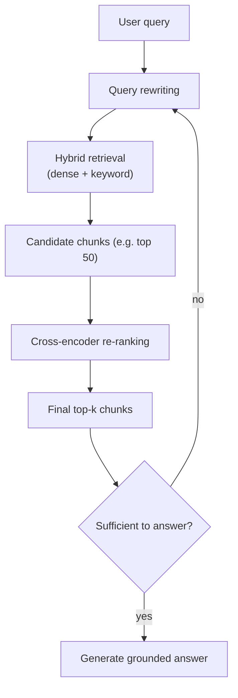

### 📝 Exercise 11.1
A user asks a RAG-powered assistant, "What was our Q3 revenue?" but the top retrieved chunk is actually about Q2 revenue from a similarly worded report. Using §11.4, propose two specific pipeline improvements that would reduce the likelihood of this retrieval error, and explain the mechanism by which each would help.

---

## 12. Evaluating LLMs

> **Key Takeaway:** No single metric captures LLM quality: perplexity measures next-token prediction, BLEU/ROUGE measure lexical overlap with a reference, benchmarks (MMLU, HELM…) measure broad capability but saturate and risk contamination. 2026 practice increasingly relies on LLM-as-judge, live benchmarks, and real task-completion metrics.

Evaluation is arguably the hardest practical problem in generative AI: unlike a classifier, there is rarely a single "correct" output to compare against, and the space of possible good answers is enormous.

### 12.1 Intrinsic metrics: perplexity

> **Key Takeaway:** Perplexity (exp of cross-entropy loss) measures how well a model predicts held-out text, useful for tracking language-modeling quality, but silent on whether outputs are actually correct or useful.

As introduced in §5.1, **perplexity** measures how well a model predicts held-out text:

```
PPL = exp(cross-entropy loss)
```

Perplexity is cheap to compute (it only requires the model and a held-out text corpus, no human judgment) and useful for comparing checkpoints *during pretraining* or tracking whether fine-tuning has degraded general language modeling ability. Its major limitation: it measures how *predictable* text is to the model, not whether the model's *own generations* are useful, correct, or safe, a model can have excellent perplexity on Wikipedia while being a poor conversational assistant.

### 12.2 Task-specific overlap metrics: BLEU and ROUGE

> **Key Takeaway:** BLEU (precision-oriented, translation) and ROUGE (recall-oriented, summarization) measure n-gram overlap with a reference, they reward matching words, not matching meaning.

For tasks with a reference "gold" output (translation, summarization), classic metrics compare **n-gram overlap** between the generated text and one or more reference texts.

**BLEU** (translation) is roughly a *precision*-oriented metric: of the n-grams the model generated, what fraction also appear in the reference translation(s)? (With a brevity penalty to discourage generating very short, artificially "precise" outputs.)

**ROUGE** (summarization) is roughly a *recall*-oriented metric: of the n-grams in the reference summary, what fraction did the generated summary successfully reproduce? Several variants exist:
- **ROUGE-N**: overlap of contiguous n-grams (ROUGE-1 = unigrams, ROUGE-2 = bigrams).
- **ROUGE-L**: based on the *longest common subsequence* between generated and reference text (need not be contiguous), capturing sentence-level structural similarity.
- **ROUGE-W / ROUGE-S**: weighted and skip-bigram variants refining the basic idea.

**Shared limitation of both metrics**: they reward surface-level lexical overlap, not semantic correctness. A summary that captures the right *meaning* using entirely different words scores poorly; a summary using the right words in a *misleading* order or combination can score well despite being wrong. This is why, in 2026 practice, these metrics are increasingly supplemented or replaced by LLM-as-judge evaluation (§12.4) for anything beyond narrow, reference-constrained tasks.

### 12.3 Benchmark suites

> **Key Takeaway:** GLUE/SuperGLUE, MMLU, BigBench, and HELM measure broad capability across many tasks, but static benchmarks saturate over time and risk contamination from leaking into later models' training data.

| Benchmark | Measures |
|---|---|
| **GLUE / SuperGLUE** | General natural language understanding across a diverse set of tasks (entailment, similarity, question-answering…) |
| **MMLU** | Multitask accuracy across 57 academic and professional subjects, from elementary math to law and medicine |
| **BigBench(-Hard)** | A broad, deliberately challenging set of tasks probing scale, calibration, and social bias |
| **HELM** | Holistic, transparent, multi-metric evaluation, not just accuracy, but robustness, fairness, efficiency, and calibration together |

**A structural problem with all static benchmarks**: once a benchmark's questions are public, they risk leaking into future models' *training* data (deliberately or accidentally, via web scraping), inflating scores without reflecting genuine capability improvement, a problem called **contamination**. Well-known static benchmarks have also gradually **saturated**: frontier models now score so highly on MMLU, for instance, that it has limited power left to discriminate between top-tier models.

### 12.4 Modern evaluation practice (2026)

> **Key Takeaway:** LLM-as-judge comparisons, live/contamination-resistant leaderboards, human preference arenas, and agentic task-completion benchmarks increasingly supplement or replace static reference-based metrics.

Given the limitations above, current practice increasingly relies on:

- **LLM-as-judge** — using a strong LLM to compare pairs of candidate responses (or score a single response against a rubric), rather than relying purely on fixed reference-text overlap. This scales far better than human annotation and correlates reasonably well with human judgment on many tasks, though it inherits its own biases (e.g., favoring longer or more confidently-worded responses) that must be actively corrected for.
- **Live / contamination-resistant leaderboards** — benchmarks with frequently refreshed problem sets (or problems generated fresh, on demand) specifically to reduce the risk that a model has simply memorized the answers during pretraining.
- **Human preference arenas** — crowdsourced, blind, pairwise comparisons between model outputs, aggregated into a ranking (conceptually similar to a chess Elo rating), capturing real user preference rather than a fixed rubric.
- **Agentic / task-completion benchmarks** — rather than a single static question, these measure whether a model can actually *complete a real, multi-step job end to end* (e.g., a substantial coding task, a multi-step research task), which better reflects the agentic deployment patterns increasingly common in production (§14).

### 📝 Exercise 12.1
A summarization model achieves a high ROUGE-L score on a benchmark but human reviewers consistently flag its summaries as containing subtly incorrect causal claims not supported by the source text. Explain why ROUGE-L would fail to detect this problem, and propose an evaluation approach from §12.4 that would be more likely to catch it.

---

## 13. Multimodal Generative Models

> **Key Takeaway:** Diffusion models generate images/video/audio by learning to reverse a gradual noise-adding process; contrastive pretraining (CLIP) links text and images in a shared embedding space. Frontier 2026 models are natively multimodal, text, image, audio, and video trained jointly from the start, not bolted together.

### 13.1 From GANs to diffusion

> **Key Takeaway:** GANs (adversarial, unstable, sharp outputs) and VAEs (stable, historically blurrier) dominated pre-2022; diffusion models have since become the dominant approach for high-quality generation.

Early generative *image* models (pre-2022, roughly) were dominated by two architectures:
- **GANs (Generative Adversarial Networks)** — a *generator* network learns to produce realistic samples while a *discriminator* network learns to distinguish generated samples from real ones; the two are trained adversarially, each improving in response to the other. GANs can produce sharp, high-quality images but are notoriously unstable to train (a delicate two-network balance) and prone to **mode collapse** (the generator finds a small set of outputs that reliably fool the discriminator and stops producing diverse samples).
- **VAEs (Variational Autoencoders)** — an encoder compresses data into a structured, continuous latent space, and a decoder reconstructs data from points in that space; new samples are generated by decoding random points from the latent distribution. VAEs train more stably than GANs but historically produced blurrier outputs.

Since roughly 2022, **diffusion models** have become the dominant approach for high-quality image, video, and audio generation, largely superseding both for top-tier generation quality.

### 13.2 Diffusion models, conceptually and mathematically

> **Key Takeaway:** A forward process gradually adds noise to real data; a network is trained to predict and reverse that noise step by step, so pure random noise can be iteratively denoised into a realistic, prompt-guided sample.

The core idea: define a **forward process** that gradually destroys structure in real data by adding small amounts of Gaussian noise over many steps, until the data becomes indistinguishable from pure noise. Then train a neural network to learn the **reverse process** — removing noise step by step, so that, starting from pure random noise, iteratively applying the learned denoising steps produces a realistic sample.

```
Forward:   x_t = sqrt(ᾱ_t)·x_0 + sqrt(1−ᾱ_t)·ε,     ε ~ N(0, I)
Training:  minimize  E‖ ε − ε_θ(x_t, t) ‖²   (predict the noise that was added)
Sampling:  iteratively denoise x_T → x_(T-1) → ... → x_0
```

- `x_0` is a real data sample (e.g., a real image); `x_T` is pure noise after `T` forward steps.
- `ᾱ_t` is a scheduled constant (decreasing from near 1 at `t=0` to near 0 at `t=T`) controlling how much of the original signal remains versus how much noise has been added at step `t`.
- The network `ε_θ` is trained on a remarkably simple objective: given a noisy image `x_t` and the timestep `t`, predict the *noise* `ε` that was added to produce it, not the clean image directly. This turns out to be an easier, more stable training target than direct image reconstruction.
- At generation time, starting from pure noise `x_T`, the model repeatedly predicts and subtracts a small amount of noise, guided by the learned `ε_θ`, gradually revealing a coherent image over many (or, with modern accelerated samplers, surprisingly few) steps.

Text-to-image diffusion models (e.g., the Stable Diffusion / DALL-E / Imagen family) condition this denoising process on a text embedding (from the same kind of text encoder discussed in §13.3), so the noise-removal process is steered toward producing an image matching the text description at every step.

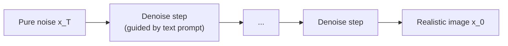

### 13.3 Connecting modalities: contrastive pretraining

> **Key Takeaway:** CLIP-style contrastive pretraining trains a text encoder and image encoder jointly so matching (image, caption) pairs land close together in a shared vector space, the foundation for text-to-image search and generation.

How does a diffusion model, or any system, relate a text description to visual content in the first place? A common foundation is **contrastive pretraining**, popularized by CLIP (Radford et al., 2021): a text encoder and an image encoder are trained *jointly*, using a large dataset of (image, caption) pairs scraped from the web, with an objective that pulls matching pairs' embeddings close together in a shared vector space while pushing mismatched pairs apart:

```python
# Simplified CLIP-style contrastive loss (conceptual, not production code)
def contrastive_loss(image_embeddings, text_embeddings, temperature=0.07):
    # Both are (batch_size, embedding_dim), L2-normalized
    logits = image_embeddings @ text_embeddings.T / temperature
    labels = arange(batch_size)  # matching pairs are on the diagonal
    loss_i2t = cross_entropy(logits, labels)
    loss_t2i = cross_entropy(logits.T, labels)
    return (loss_i2t + loss_t2i) / 2
```

Each row/column of `logits` compares one image to *every* caption in the batch; the loss pushes the correct (diagonal) image-caption pair's similarity score higher than all the mismatched (off-diagonal) pairs in that batch. After training on hundreds of millions of pairs, the resulting shared embedding space lets a system compare, retrieve, and ground text against images directly via cosine similarity (§11.2), exactly the mechanism that makes text-to-image search, zero-shot image classification, and text-guided diffusion generation all possible.

### 13.4 Native multimodality (2026)

> **Key Takeaway:** Rather than bolting a vision encoder onto a text model, current flagship models train text, image, audio, and video jointly from the start, often through shared MoE expert pathways, producing tighter cross-modal reasoning.

Rather than bolting a separately-trained vision encoder onto a text-only LLM (a "late fusion" design, common in earlier vision-language models), current flagship models are increasingly trained with **text, image, audio, and sometimes video jointly from the start** of pretraining, sharing the same underlying transformer backbone, often routed through shared or modality-specialized expert pathways inside an MoE architecture (§5.4, §4.7).

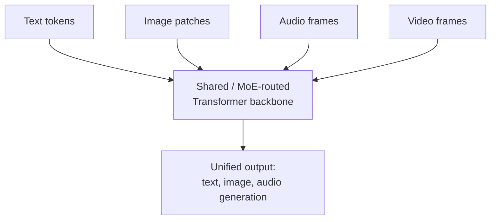

This produces tighter cross-modal reasoning than late-fusion pipelines, for example, reasoning jointly over a chart image and a text question about it, or generating a spoken explanation with correct emphasis based on the emotional content of an image, because the different modalities influence the *same* internal representations from the earliest layers of processing, rather than being combined only at a late, already-abstracted stage.

### 📝 Exercise 13.1
Explain, using the diffusion training objective in §13.2, why the model is trained to predict the *noise* `ε` rather than directly predicting the clean image `x_0`. (Hint: consider what the relationship is between `x_t`, `x_0`, and `ε` in the forward process formula, and whether predicting one lets you recover the others.)

---

## 14. Agentic AI & Tool Use

> **Key Takeaway:** Agents operate in a reason → act → observe loop (ReAct): the LLM proposes a tool call, a surrounding harness executes it, and the result feeds back into context for the next step, repeating until the task is complete, rather than answering in a single shot.

### 14.1 From single-turn completion to multi-step agency

> **Key Takeaway:** Instead of one prompt → one completion, an agent iterates: reason about the next action, call a tool if needed, observe the result, and repeat until the task is done.

Everything covered so far treats the LLM as answering a single prompt with a single completion. A growing share of real-world LLM deployment is instead **agentic**: the model operates in a loop, deciding to call external tools (search engines, code execution environments, APIs, file systems, other software), observing the results of those calls, and iterating, reasoning, acting, and revising, until a task is complete, rather than producing one final answer immediately.

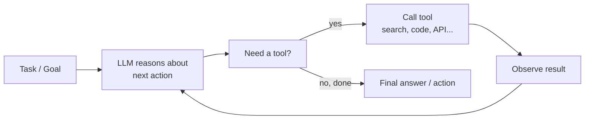

This pattern is often called **ReAct** (Reason + Act): at each step, the model produces a short piece of reasoning about what to do next, then either takes an action (a tool call) or produces a final answer, and the *result* of any tool call is fed back into the model's context for the next reasoning step. It underlies coding agents (that read files, run tests, and edit code across many iterations), research agents (that search, read, and synthesize across many sources), and computer-use agents (that operate a graphical interface directly).

### 14.2 What "tool calling" actually looks like

> **Key Takeaway:** The LLM only ever emits structured text requests; a separate application harness parses, validates, executes the tool call, and feeds the result back into the model's context.

Practically, tool use is implemented by describing available tools to the model (typically as a structured schema: name, description, and expected parameters), and training/prompting the model to emit a structured request (commonly JSON) when it wants to invoke one, rather than a free-form natural-language answer.

```python
# A simplified illustration of one step of an agent loop

tools = [
    {
        "name": "search_web",
        "description": "Search the web for current information",
        "parameters": {"query": "string"}
    },
    {
        "name": "run_python",
        "description": "Execute a Python snippet and return stdout",
        "parameters": {"code": "string"}
    }
]

def agent_step(conversation_history):
    response = llm.generate(conversation_history, available_tools=tools)
    if response.wants_tool_call:
        tool_name = response.tool_call.name
        tool_args = response.tool_call.arguments
        result = execute_tool(tool_name, tool_args)          # actually run it
        conversation_history.append({"role": "tool", "content": result})
        return agent_step(conversation_history)               # loop again
    else:
        return response.final_answer                          # done

def run_agent(task, max_steps=10):
    history = [{"role": "user", "content": task}]
    for step in range(max_steps):
        result = agent_step(history)
        if result is not None:
            return result
    return "Max steps reached without a final answer."
```

The core engineering pattern is: **LLM proposes an action → external system executes it → result is appended to context → LLM sees the result and reasons about the next step.** Notice that the LLM never directly touches the outside world, it only ever emits text; a surrounding *harness* (application code) is responsible for actually parsing tool-call requests, executing them safely, and feeding results back in. This separation is important for safety and reliability: the harness can validate, sandbox, rate-limit, or reject proposed actions before they take effect.

### 14.3 What makes reliable agentic behavior possible

> **Key Takeaway:** Reliable structured tool-calling, a large enough context window to hold the full multi-step trace, and strong (often RLVR-trained) reasoning ability to plan and self-correct are what make agentic loops actually work in practice.

Effective agentic systems depend on several capabilities coming together:
- **Reliable structured tool-calling formats** — the model must consistently produce well-formed requests the harness can parse; ambiguous or malformed tool calls break the loop.
- **Sufficient context window** (§4) to hold an entire multi-step trace, task description, reasoning, tool calls, and tool results accumulate across many turns, and long-horizon tasks can generate very long histories.
- **Strong reasoning ability** (§6.3, §10.4) — the model needs to plan multi-step approaches, notice when a tool result doesn't match its expectation, and self-correct rather than blindly continuing a flawed plan. This is precisely the capability RLVR-style training (§10.4) is designed to strengthen, which is why the rise of reasoning models and the rise of capable agentic systems have gone hand in hand since roughly 2024–2025.
- **Grounded, verifiable feedback loops where possible** — an agent that can run the code it writes and see the actual error message (rather than only guessing whether code is correct) can self-correct far more reliably than one operating purely on its own unchecked reasoning, this is essentially RLVR's core insight (§10.4) applied at inference time, not just during training.

### 📝 Exercise 14.1
Sketch (in pseudocode or a short description) a ReAct-style tool set and loop for an agent whose task is: "check whether a given equipment ID has any open maintenance tickets, and if so, summarize them." What tools would it need, and what is a plausible sequence of reasoning/action/observation steps?

---

## 15. Responsible AI: Risks, Limitations, Governance

> **Key Takeaway:** Deploying generative AI means actively managing hallucination, bias, reward hacking, data contamination, catastrophic forgetting, overreliance, and misuse, with layered guardrails (grounding, evaluation, human review) rather than a single safety net.

Generative AI's rapid capability gains have been accompanied by well-documented risks that any deployment should account for. This section is deliberately concise, a starting checklist, not exhaustive coverage of AI ethics and safety.

### 15.1 Key risk categories

> **Key Takeaway:** Hallucination, bias, reward hacking, contamination, catastrophic forgetting, overreliance, and misuse are the seven risk categories to actively design against, each connecting back to a mitigation covered earlier in the course.

| Risk | Description | Mitigations touched on earlier in this course |
|---|---|---|
| **Hallucination** | Confidently generating false or unsupported statements | RAG (§11) to ground responses in retrieved evidence; encouraging calibrated uncertainty via alignment (§10) |
| **Bias** | Reproducing or amplifying biases present in training data | Diverse, curated instruction/preference data (§8.2, §10.2); benchmarks like HELM explicitly measuring fairness (§12.3) |
| **Reward hacking** | Optimizing a proxy objective (a reward model, a benchmark) in ways that don't reflect true intent | KL penalties in RLHF (§10.2); verifiable rewards in RLVR where possible (§10.4); holistic evaluation (§12.4) |
| **Data contamination** | Benchmark answers leaking into training data, inflating apparent capability | Live/refreshed benchmarks, contamination-resistant evaluation (§12.4) |
| **Catastrophic forgetting** | Losing previously reliable capabilities after fine-tuning | PEFT, multi-task fine-tuning, regression testing (§8.3, §9) |
| **Overreliance / automation bias** | Users trusting outputs uncritically because they are fluent and confident-sounding | Surfacing sources/citations (RAG, §11), calibrated communication of uncertainty, human-in-the-loop review for high-stakes decisions |
| **Misuse** | Using generative capability for disinformation, fraud, or harmful content generation | Alignment training (§10), usage policies, content moderation, access controls |

### 15.2 A practical checklist before deploying a generative AI system

> **Key Takeaway:** Before deployment, define the cost of an undetected error, ensure outputs are traceable to evidence, build representative evaluation, close the production feedback loop, and layer multiple independent guardrails.

1. **What happens when the model is wrong?** — define the cost of an undetected error for your specific use case, and design human review proportional to that cost.
2. **Can outputs be traced to evidence?** — RAG-style grounding and citation (§11) makes review and error-correction dramatically easier than a purely parametric system.
3. **Is the evaluation representative of real usage?** — static benchmarks (§12.3) rarely match your actual deployment distribution; build task-specific evaluation.
4. **Is there a feedback loop from production back into evaluation/training?** — monitoring real failures and feeding them back into fine-tuning data, preference data, or RAG knowledge-base updates.
5. **Are guardrails layered, not singular?** — prompt-level instructions, output filtering/classification, and human review each catch different failure modes; relying on only one is fragile.

---

## 16. The 2026 State-of-the-Art Landscape

> **Key Takeaway:** Frontier generative AI in 2026: Mixture-of-Experts is the default architecture, RLVR-trained reasoning models are standard, alignment pipelines are hybrid (SFT→DPO→RLVR), multimodality is native, agentic tool-use is mainstream deployment, and efficiency engineering (GQA, RoPE, FlashAttention, quantization) is as important as raw scale.

A brief snapshot of where frontier generative AI stands, to contextualize the foundations covered above, and a reminder that this is a fast-moving field:

- **Mixture-of-Experts is now the default architecture** for essentially every serious frontier open-weight model, replacing dense transformers as the standard design (§5.4). Total parameter counts have grown into the hundreds of billions to low trillions, while *active* parameters per token remain a small fraction of that.
- **Reasoning models** are trained (largely via RLVR, §10.4) to generate long internal chains of thought before answering, substantially improving performance on math, coding, and multi-step logic, at the cost of higher inference latency and token usage per query. This connects directly to the chain-of-thought ideas introduced in §6.3, now baked into training rather than elicited only through prompting.
- **Alignment is hybrid**: SFT → DPO-family methods for general preference alignment, RLVR for verifiable domains, with classical RLHF/PPO reserved for narrower cases (§10.4).
- **Native multimodality** is standard in flagship models rather than an add-on (§13.4).
- **Agentic use is mainstream**: coding agents, computer-use agents, and research agents built on tool-calling loops (§14) are now a primary deployment pattern, not a research curiosity.
- **Efficiency engineering matters as much as raw scale**: GQA/MQA, RoPE, FlashAttention, quantization (e.g., 4-bit inference, echoing QLoRA's approach in §9.3), and MoE (§5.4, §4.7) all trade a small amount of quality for large gains in serving cost and context length, which increasingly determines what's actually deployable in production.
- **Evaluation is shifting** away from static leaderboards prone to saturation and contamination toward live benchmarks, LLM-as-judge comparisons, and real task-completion metrics (§12.4).

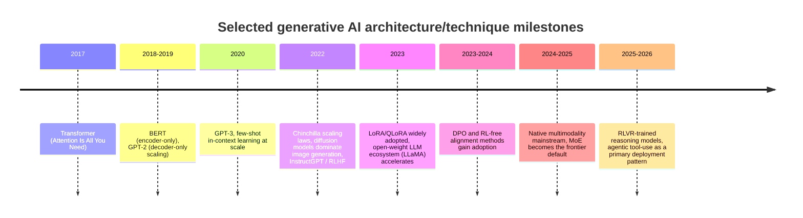

This is a fast-moving field, treat any specific model name or benchmark number as a snapshot, and verify current details before relying on them for a decision. The underlying *mechanisms* covered in this course (attention, scaling laws, PEFT, alignment objectives, retrieval) are far more durable than any specific model's ranking on a leaderboard at a given moment.

---

## 17. Practical Ecosystem & Tools

> **Key Takeaway:** Hugging Face (`transformers`/`peft`/`trl`), Ollama, vLLM/TGI, and LangChain/LlamaIndex operationalize this course's concepts, PEFT/LoRA training, efficient serving, and RAG/agent orchestration, without building everything from scratch.

| Tool | Use | Where it fits in this course |
|---|---|---|
| **Hugging Face** | Model hub, datasets, and open-source ML libraries (`transformers`, `peft`, `trl`) | Loading pretrained models (§5), running PEFT/LoRA (§9), running RLHF/DPO training (§10) |
| **Ollama** | Simple local deployment of open-weight LLMs | Hands-on exercises, quick local experimentation |
| **vLLM / TGI** | High-throughput production inference serving | Efficient decoding (§7), serving MoE/quantized models (§5.4, §9.3) |
| **LangChain / LlamaIndex** | RAG and agent orchestration frameworks | Building the RAG pipeline (§11) and agent loops (§14) without writing everything from scratch |
| **DiFy** | Low-code platform for deploying LLM applications | Rapid prototyping of a full application around a model |
| **H2O.ai** | Open-source RAG / GPT/LLM studio | Alternative RAG tooling |

### A minimal end-to-end example: LoRA fine-tuning with Hugging Face `peft`

> **Key Takeaway:** A `LoraConfig` (rank, target modules) plugs directly into a standard Hugging Face `Trainer`, the same rank/parameter-count trade-offs discussed mathematically in §9.3 apply directly here.

```python
from transformers import AutoModelForCausalLM, AutoTokenizer
from peft import LoraConfig, get_peft_model

model_name = "your-base-model"
model = AutoModelForCausalLM.from_pretrained(model_name)
tokenizer = AutoTokenizer.from_pretrained(model_name)

# Configure LoRA: rank r, which modules to adapt, etc. (see §9.3)
lora_config = LoraConfig(
    r=8,                                  # rank
    lora_alpha=16,                        # scaling factor for BA
    target_modules=["q_proj", "v_proj"],  # attach LoRA to Query/Value projections
    lora_dropout=0.05,
    task_type="CAUSAL_LM",
)

peft_model = get_peft_model(model, lora_config)
peft_model.print_trainable_parameters()
# Typical output: "trainable params: 4,194,304 || all params: 7,000,000,000
#                  || trainable%: 0.06" -- illustrating the §9.3 parameter-count math directly

# From here, `peft_model` trains with a standard Hugging Face `Trainer`
# exactly like a normal fine-tuning run, but only the small LoRA matrices update.
```

This is deliberately close to what you will run in the hands-on portion of Module 5 (§9), the `LoraConfig` fields map directly onto the rank `r` and target-matrix choices discussed there.

---

## 18. Group Project

> **Key Takeaway:** Apply this course's adaptation-strategy framework to a real project: justify your choice of prompting, PEFT, full fine-tuning, or RAG (or a combination) quantitatively, using the reasoning from §9.3 and §11.3, rather than by default.

**Team roles:**
- AI Researcher : Choose the right AI approach and justify it based on quantitative metrics, project requirements, and expected impact
- Data Engineering : Define and apply the data strategies for collecting, cleaning, and preprocessing
- ML Engineer : Train, evaluate model performences, select appropriate evaluation metrics, and optimize hyperparameters.
- Integration : Integrate the model on the system and ensure seamless deployment into production environments
- Scrum master : Coordinate team activities, track progress , and resolve blockers

**Format:** 5-minute presentation to pitch the project
- WPM and team → Head of Innovation

**Project objective — the WHY:**
- produce a report, abstract to conclusion
- Compliance required

**Suggested project framing, tying back to the course:** pick a concrete task, then justify, using §6–11 — which adaptation strategy (prompting only, PEFT, full fine-tuning, RAG, or a combination) fits your constraints (data availability, compute budget, need for up-to-date knowledge, latency requirements), and be ready to defend that choice quantitatively (e.g., using the LoRA parameter-count reasoning from §9.3, or the RAG-vs-fine-tuning trade-off from §11.3) rather than by default.

---

## 19. Glossary

| Term | Definition |
|---|---|
| **Prompt / Completion** | The input text given to an LLM / the text it generates in response |
| **Context window** | The maximum amount of text (in tokens) a model can process at once |
| **Inference** | The act of running a trained model to generate output |
| **Token** | A unit of text (word, subword, or character) processed by the model |
| **Embedding** | A dense numerical vector representation of a token, sentence, or document |
| **Self-attention** | The mechanism by which a token's representation is updated based on a weighted combination of all other tokens |
| **Fine-tuning** | Updating a pretrained model's weights on a new task/dataset |
| **PEFT** | Parameter-Efficient Fine-Tuning, updating only a small subset of parameters |
| **LoRA** | Low-Rank Adaptation, a reparameterization PEFT method |
| **RLHF** | Reinforcement Learning from Human Feedback |
| **DPO** | Direct Preference Optimization |
| **RLVR** | Reinforcement Learning with Verifiable Rewards |
| **RAG** | Retrieval-Augmented Generation |
| **MoE** | Mixture-of-Experts architecture |
| **Catastrophic forgetting** | Loss of previously learned capabilities after fine-tuning on a new task |
| **Perplexity** | `exp(cross-entropy loss)`, a measure of next-token prediction uncertainty |
| **Chinchilla scaling laws** | Empirical relationship between model size, training tokens, and compute for optimal pretraining |
| **Hallucination** | A confidently generated but false or unsupported statement |
| **Reward hacking** | Exploiting a proxy objective (e.g., a learned reward model) in ways that don't reflect true intent |
| **Agentic AI / ReAct** | An LLM operating in a reason-act-observe loop, calling external tools to accomplish multi-step tasks |

---

## 20. References

### Books and courses
- Goodfellow, I., Bengio, Y., & Courville, A. (2016). *Deep Learning*. MIT Press.
- *Generative AI with Large Language Models*, deeplearning.ai & AWS
- *Natural Language Processing Specialization*, deeplearning.ai
- Goldberg, Y. (2017). *Neural Network Methods for NLP*. Morgan & Claypool.
- Manning, C. D., & Schütze, H. (1999). *Foundations of Statistical NLP*. MIT Press.

### Foundational papers
- Vaswani et al. (2017). *Attention Is All You Need.*
- Mikolov et al. (2013). *Efficient Estimation of Word Representations in Vector Space* (word2vec).
- Devlin et al. (2018). *BERT: Pre-training of Deep Bidirectional Transformers for Language Understanding.*
- Brown et al. (2020). *Language Models are Few-Shot Learners* (GPT-3).
- Wei et al. (2022). *Chain-of-Thought Prompting Elicits Reasoning in Large Language Models.*
- Hoffmann et al. (2022). *Training Compute-Optimal Large Language Models* ("Chinchilla").
- Touvron et al. (2023). *LLaMA: Open and Efficient Foundation Language Models.*
- Hu et al. (2021). *LoRA: Low-Rank Adaptation of Large Language Models.*
- Dettmers et al. (2023). *QLoRA: Efficient Finetuning of Quantized LLMs.*
- Ouyang et al. (2022). *Training language models to follow instructions with human feedback* (InstructGPT).
- Stiennon et al. (2020). *Learning to summarize from human feedback.*
- Rafailov et al. (2023). *Direct Preference Optimization.*
- Chung et al. (2022). *Scaling Instruction-Finetuned Language Models* (FLAN).
- Ho, Jain & Abbeel (2020). *Denoising Diffusion Probabilistic Models.*
- Radford et al. (2021). *Learning Transferable Visual Models From Natural Language Supervision* (CLIP).
- Yao et al. (2022). *ReAct: Synergizing Reasoning and Acting in Language Models.*

### Evaluation benchmarks
- GLUE / SuperGLUE
- Papineni et al. (2002). *BLEU: a Method for Automatic Evaluation of Machine Translation.*
- Lin (2004). *ROUGE: A Package for Automatic Evaluation of Summaries.*
- Hendrycks et al. (2020). *Measuring Massive Multitask Language Understanding* (MMLU).
- Srivastava et al. (2022). *Beyond the Imitation Game* (BigBench).
- Liang et al. (2022). *Holistic Evaluation of Language Models* (HELM).

### Practical resources
- huggingface.co/blog/rlhf
- huggingface.co/blog/peft
- huggingface.co/docs/peft
- research.ibm.com/blog/retrieval-augmented-generation-RAG
- ollama.com · dify.ai · h2o.ai · langchain.com · llamaindex.ai
